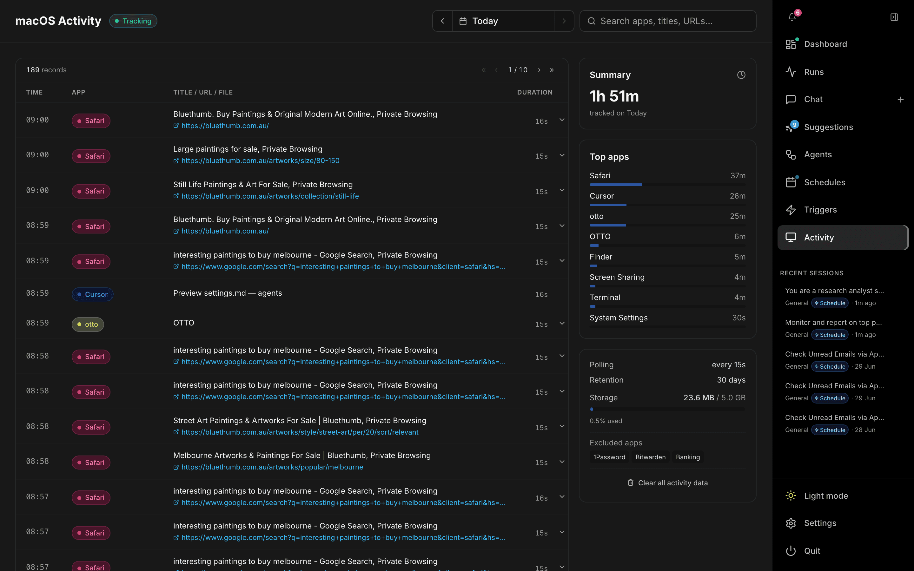

# Activity

The **Activity** page (`/activity`) shows a private, on-device timeline of your macOS usage — the context OTTO's ambient agent and memory draw on. Open it from **Activity** in the right-hand nav. Tracking is enabled and tuned under **Settings → macOS Activity**.

> No screenshots are taken. Only app names, window titles, and browser URLs are recorded, and everything stays on your machine.

---

## Header

| Control | Description |
| --- | --- |
| **macOS Activity** title | A pill shows the tracker state: **Tracking** (green), **Idle** (amber), or **Disabled**. |
| **Date picker** | Step through days with ‹ / ›, type a date (accepts `today`, `yesterday`, `5/5`, `May 5`, ISO, etc.), or pick from the calendar. A **Today** shortcut appears when viewing a past day. |
| **Search** | Full-text search across apps, window titles, and URLs (ranked by relevance, across all dates). |

When tracking is disabled, a banner explains how to enable it from Settings.

## Timeline table

| Column | Notes |
| --- | --- |
| **Time** | When the activity occurred. |
| **App** | Color-coded app badge. |
| **Title / URL / File** | Window title, with clickable URL or file path when available. |
| **Duration** | How long the entry lasted. |

Rows with extra context expand to reveal more detail. In **Day** mode the table pages through that day's records; in **Search** mode results are grouped by date and ranked by relevance. Today's view live-refreshes every 15 seconds.

## Sidebar

- **Summary** — total time tracked for the selected day (in Search mode, the match count instead).
- **Top apps** — time spent per app with proportion bars.
- **Status panel** — polling interval, retention window, and storage used (with a cap bar that warns when near the limit).
- **Excluded apps** — apps omitted from tracking (e.g. password managers, banking).
- **Clear all activity data** — wipes the local activity database (confirm to proceed).
