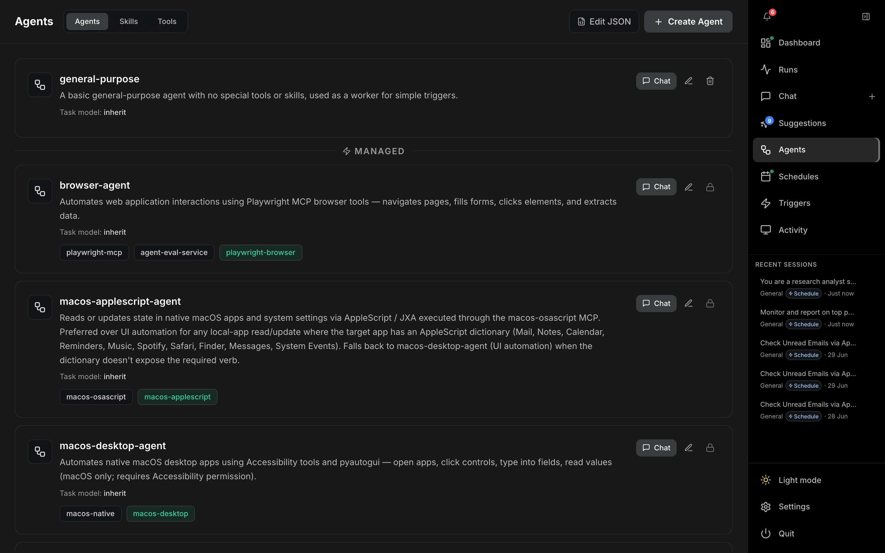

# Agents

The **Agents** page (`/agents`) manages the agents, skills, and tools available to OTTO. Open it from **Agents** in the right-hand nav.

---

## Tabs

| Tab | Contents |
| --- | --- |
| **Agents** | Your custom agents plus built-in **Managed** agents. |
| **Skills** | Reusable skill files agents can load. |
| **Tools** | MCP servers / tool integrations agents can call. |

## Agents tab

Custom agents are listed first; built-in agents appear below a **Managed** divider. Each agent card shows its name, description, **Task model** (the model used when it runs as a delegated subagent — `inherit`, `frontier`, `mlx`, `exo`/cluster, or a custom id), and chips for its MCP **tools** (grey) and **skills** (green).

| Card action | Description |
| --- | --- |
| **Chat** | Starts a new chat with that agent pre-selected. |
| **Edit** (pencil) | Opens the agent editor. |
| **Delete** (trash) | Removes a custom agent (confirm with Yes/No). |
| **Lock** | Built-in/managed agents cannot be deleted. |

### Header actions

- **Edit JSON** — edit all agents at once as raw JSON (saving replaces the full set).
- **Create Agent** — opens the agent editor dialog.

### Agent editor

The Create/Edit dialog provides:

- **Name** and **Description**.
- **System Prompt** — the agent's instructions.
- **MCP Tools** and **Skills** — chip pickers for what the agent can use.
- **Task subagent model** — choose Inherit main chat model, Frontier (Anthropic / Bedrock), MLX (local Hub, with a repo picker), Cluster (shared model), or Custom (a LangChain model-id string).

## Skills and Tools tabs

These embed the Skills and Tools managers so you can browse and configure the skill files and MCP tool servers that agents reference, without leaving the page.
