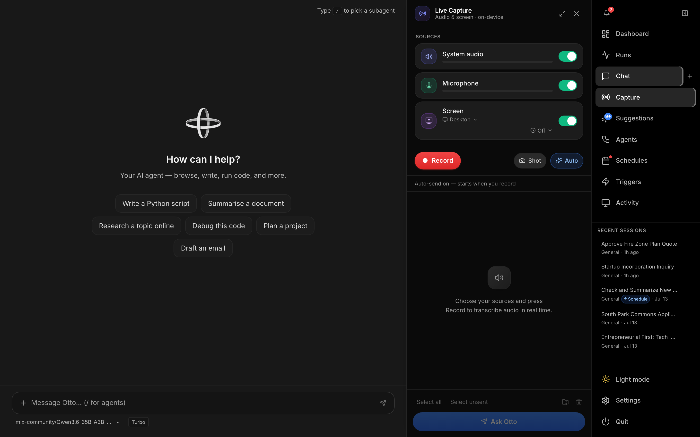
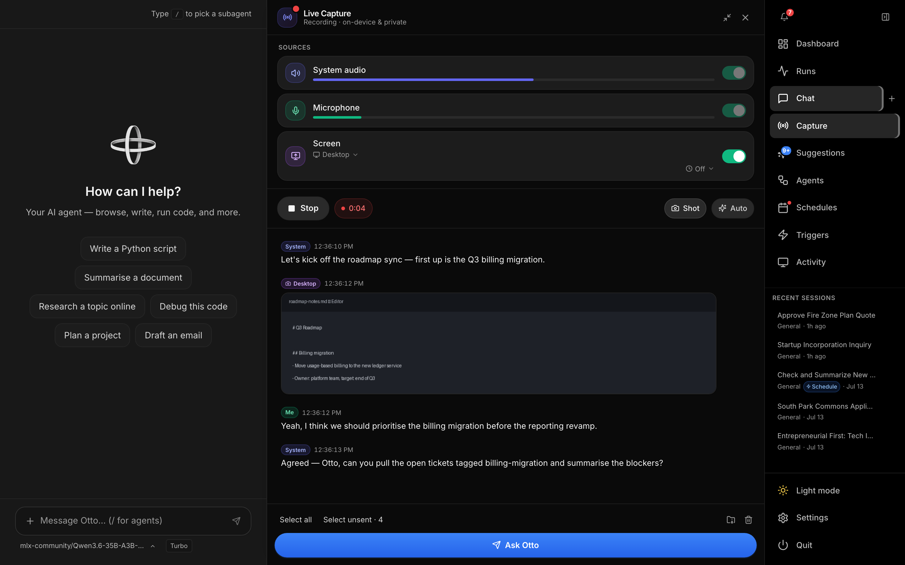
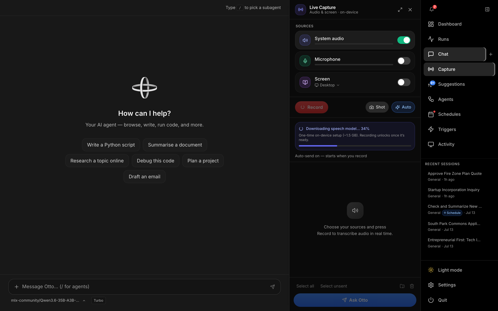

# Capture

**Capture** opens **Live Capture** — a panel that sits beside whatever page you're on (normally [Chat](chat.md)) and transcribes audio in real time, on-device. Open it from **Capture** in the right-hand nav; it's a toggleable panel, not its own route, so your recording and transcript keep running while you navigate around the rest of the app.

Everything happens locally: audio never leaves your Mac, and transcription runs against an on-device Whisper model.

---

## Sources

Three independent toggles decide what gets captured. All three can run at once.

| Source | What it captures | Requirement |
|---|---|---|
| **System audio** | Whatever your speakers/headphones are playing — calls, meeting audio, videos | macOS 14.4+ (Core Audio process tap) and the bundled `otto-audiotap` helper |
| **Microphone** | Your voice from the selected input device | A microphone; grants the standard mic permission prompt |
| **Screen** | Periodic screenshots of the desktop or a chosen window, interleaved into the transcript | Screen Recording permission |

If a source isn't available (unsupported macOS version, helper missing, no mic), its toggle is disabled with an inline reason instead of failing silently.

**Screen** target — click the target label (defaults to **Entire desktop**) to switch to **Choose window…**, which opens a picker with live thumbnails of your open windows. If the followed window closes mid-recording, Capture falls back to the desktop automatically and surfaces a notice.

---

## Recording

Press **Record** to start. The header switches to a live elapsed timer, and each enabled source shows a live level meter while audio comes in.

| Control | Description |
|---|---|
| **Record / Stop** | Start or end the session. Sources can't be changed mid-recording. |
| **Shot** | Take a screenshot of the current target immediately (desktop or the chosen window), regardless of whether **Screen** is toggled on. |
| **Auto** | Toggle hands-free auto-send (see below). On by default. |

The feed interleaves transcript lines and screenshots in the order they happened — each line is tagged **System** or **Me**, each screenshot is tagged with its target and a timestamp. Hover any item for **Send** (hand just that item to Otto) or **Trash** (remove it locally — this never affects anything already sent).

**Screen — auto-capture:** when **Screen** is on, Capture grabs a screenshot at every transcript pause (see Auto-send below) and, optionally, on a fixed timer regardless of speech (**Off** / 3s / 5s / 10s / 30s / 1m / 5m — the clock icon next to the target picker). Repeated frames are deduped by a perceptual hash so a static screen doesn't spam the feed.

### Model download gating

The first time Capture runs, it downloads the on-device Whisper speech model (~1.5 GB) from Hugging Face. **Record** stays disabled with a spinner until the download completes — no more silent hang on first use. A progress card shows live percentage as it streams in.

---

## Sending to Otto

**Ask Otto** (footer) hands the transcript + screenshots to the agent as one message, in [Chat](chat.md). The first message of any capture is prefixed with a standing instruction telling Otto this is passively-captured context, so it knows to ask a short multiple-choice question (Summarise / Extract action items / Draft a reply / etc.) when your intent isn't obvious rather than guessing.

| Action | Behaviour |
|---|---|
| **Ask Otto** | Sends everything unsent, or just the selected items if any are checked |
| Per-item **Send** | Sends a single line or screenshot immediately |
| **Select all** / **Select unsent** | Bulk-select helpers for the footer send button |
| **Auto** (hands-free) | When on, automatically sends new lines ~2.5s after you stop talking — paused while Otto is streaming a response or waiting on an `ask_user` question, and resumes once it's free |

Sent items dim slightly and get a checkmark; a **Sent to Otto** divider marks where the next unsent item starts. Clearing (trash icon in the footer) wipes the whole feed and resets the sent/selection state — handy for starting a fresh capture without closing the panel.

**Save as .zip** bundles the transcript (`transcript.txt`) and any screenshots into a single archive and hands it to the browser/OS download — useful for archiving a call outside of Otto entirely, without ever sending it to the agent.

---

## Permissions

| Permission | Needed for | Grant it via |
|---|---|---|
| Screen Recording | Screenshots (manual **Shot**, auto-capture, window thumbnails in the picker) | System Settings → Privacy & Security → Screen Recording. Capture surfaces an in-panel prompt with a direct link when it's missing. |
| Microphone | The **Microphone** source | Standard macOS prompt on first use |
| Audio Capture | The **System audio** source (Core Audio process tap) | Standard macOS prompt on first use — macOS 14.4+ only |

All three are declared in the app's `Info.plist` usage-description strings, so macOS shows a clear reason in each permission dialog.

---

## Related

- **[Chat](chat.md)** — where captured transcript and screenshots land once you hand them to Otto.
- **[Settings → Voice](settings.md#voice)** — configures hands-free voice input (mic → chat), a separate feature from Live Capture that shares the same on-device Whisper model.
- **[Settings → Privacy & Security](settings.md#privacy--security)** — **Stealth mode** hides Otto's own window from screen-share apps (including browser screen sharing), useful if you're capturing a call you're also sharing your screen on. Its **Compact mode** companion (only offered once stealth is on) additionally moves Otto into focus-safe Chat + Live Capture panels.
