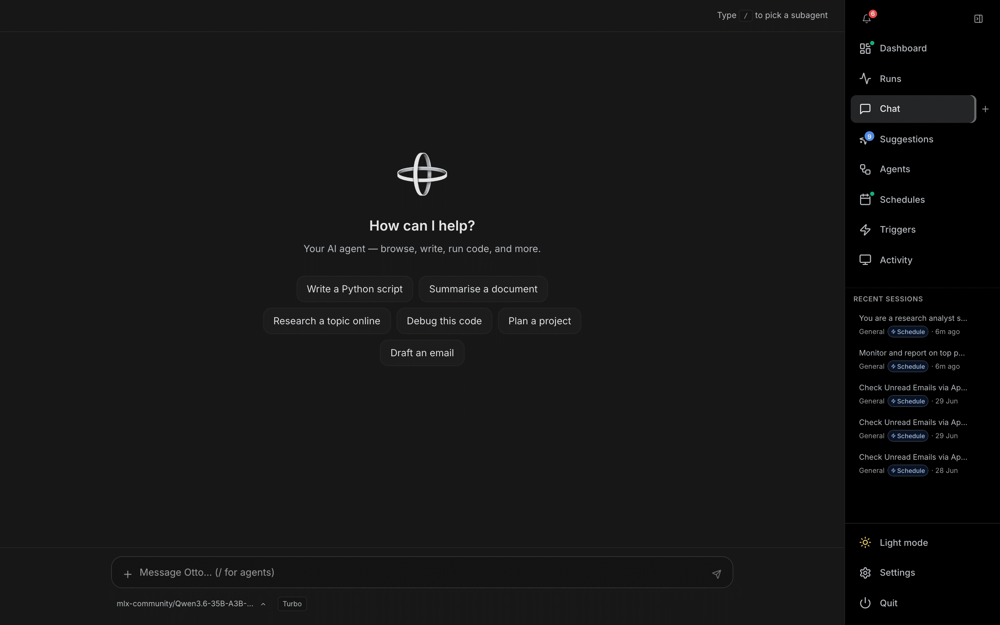
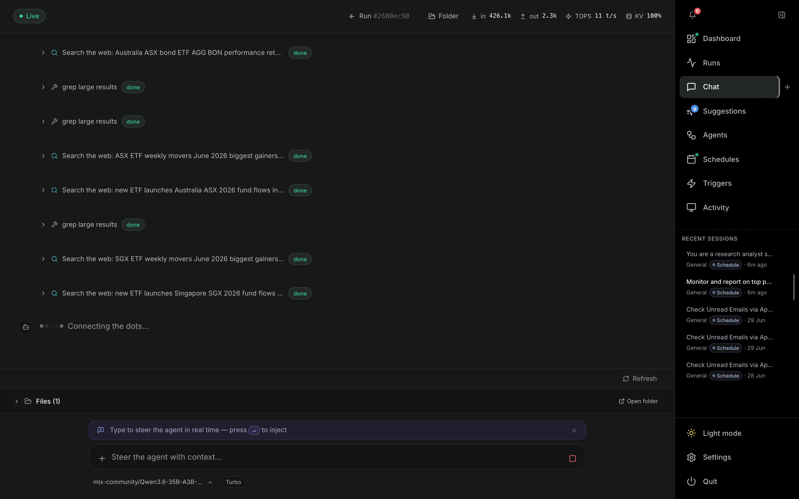

# Chat

**Chat** (`/chat`) is the main way to talk to OTTO. Open it from **Chat** in the right-hand nav, or press the **+** next to it (or ⌘N / Ctrl+N) to start a fresh session. Recent sessions are listed under the nav and each conversation is also recorded on the [Runs](runs.md) page.

---

## New session

A new chat shows the **How can I help?** welcome screen with quick-start prompt chips (Write a Python script, Summarise a document, Research a topic online, Debug this code, Plan a project, Draft an email). Click a chip to drop it into the composer.

## Composer

| Element | Description |
| --- | --- |
| **Message box** | Type your request. `/` opens a picker to route the turn to a specific subagent; otherwise the orchestrator decides how to handle it. |
| **Model selector** | Bottom-left chip shows the active model (e.g. an MLX model) and tier (**Turbo** / Standard / Frontier). |
| **Attachments** | The **+** in the composer attaches files; you can also drag-and-drop files or folders onto the window. |
| **Send** | Submits the message (Enter). |

## Active conversation

Once a run starts, the transcript streams in real time — agent messages, tool calls, and tool results with status badges (e.g. `done`).

| Feature | Description |
| --- | --- |
| **Live / Connecting** | Connection pill (top-left) reflects the websocket status. |
| **Run header** | When a run is active, the header shows the run id and live token/throughput stats (tokens in/out, TOPS t/s, KV cache %). |
| **Graph** | Appears when subagents are involved — toggles an agent graph view of the delegation tree. |
| **Run #id** | Jumps to the full [run detail](runs.md) page for the session. |
| **Folder** | Opens the session's working files folder on disk. |
| **Files** | Lists files produced during the run. |
| **Steer the agent** | While a run is in progress you can inject extra context mid-flight; the agent picks it up on its next step. |
| **Stop** | The square button halts an in-progress run. |
| **Memory hits** | A brain badge shows how many responses used injected long-term memory. |

Subagent activity is grouped, and any errors are pinned to the end of the conversation so they are never buried in the middle of a long transcript.

---

## Capture

The **Capture** nav item docks a [Live Capture](capture.md) panel beside Chat for on-device system-audio and microphone transcription (plus optional screenshots). Captured transcript and screenshots are handed to the current chat session via **Ask Otto** or hands-free auto-send, appearing as a normal message in this conversation.
