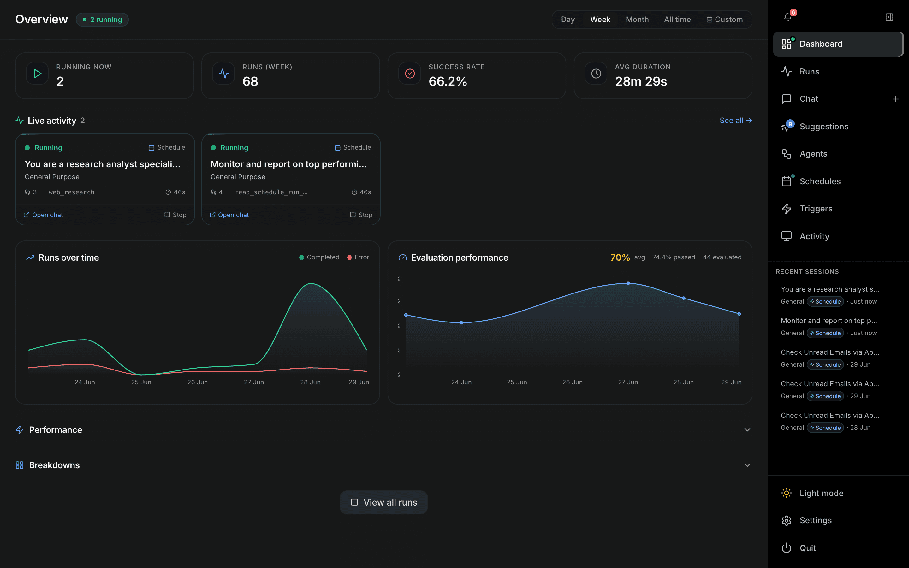

# Dashboard

The **Dashboard** (`/dashboard`) is the at-a-glance overview of everything OTTO is doing. It opens from the **Dashboard** item at the top of the right-hand nav and refreshes automatically every few seconds.

---

## Header

| Control | Description |
| --- | --- |
| **Overview** title | A green **N running** pill appears when runs are in progress. |
| **N needs feedback** | Amber pill shown when runs are paused awaiting your input; click to jump to `Runs` filtered by `awaiting_input`. |
| **Period selector** | `Day` · `Week` · `Month` · `All time` · `Custom`. The choice is remembered between visits. |
| **Custom range** | Picking `Custom` reveals two date inputs and an **Apply** button to scope every metric and chart to that window. |

## Hero KPIs

Four cards summarise the selected period:

- **Running now** — live count of in-progress runs.
- **Runs (period)** — total runs in the window.
- **Success rate** — percentage completed without error (green ≥ 90%, amber ≥ 70%, red below).
- **Avg duration** — mean run time, with estimated cost underneath when there is spend.

## Live activity

Cards for every run that is currently **Running** or **Needs feedback** (awaiting-input runs are surfaced first). Each card shows the title, agent, source, step count, last tool, and a ticking elapsed timer that turns amber once a run passes ~10 minutes. Buttons let you **Open chat** / **Reply now** or **Stop** the run. **See all →** opens the full `Runs` list.

## Charts

- **Runs over time** — completed vs. error runs across the period.
- **Evaluation performance** — average eval score trend, with avg %, pass rate, and the number of evaluated runs in the legend.

## Collapsible sections

| Section | Contents |
| --- | --- |
| **Performance** | Token totals (in / out), prefill throughput (TIPS), generation throughput (TOPS), and KV cache hit ratio. |
| **Breakdowns** | Top agents, top tools, sources, and models for the period. |
| **Cost by model** | Per-model spend bars — only shown when there is cost to report. |

A **View all runs** button at the bottom links straight to the `Runs` page.
