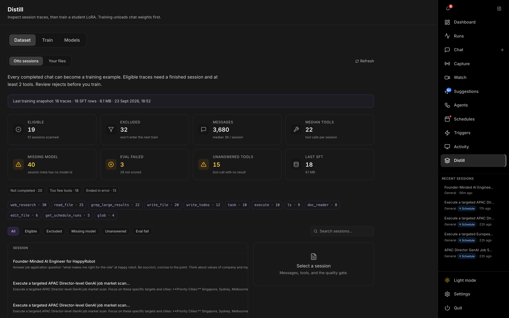
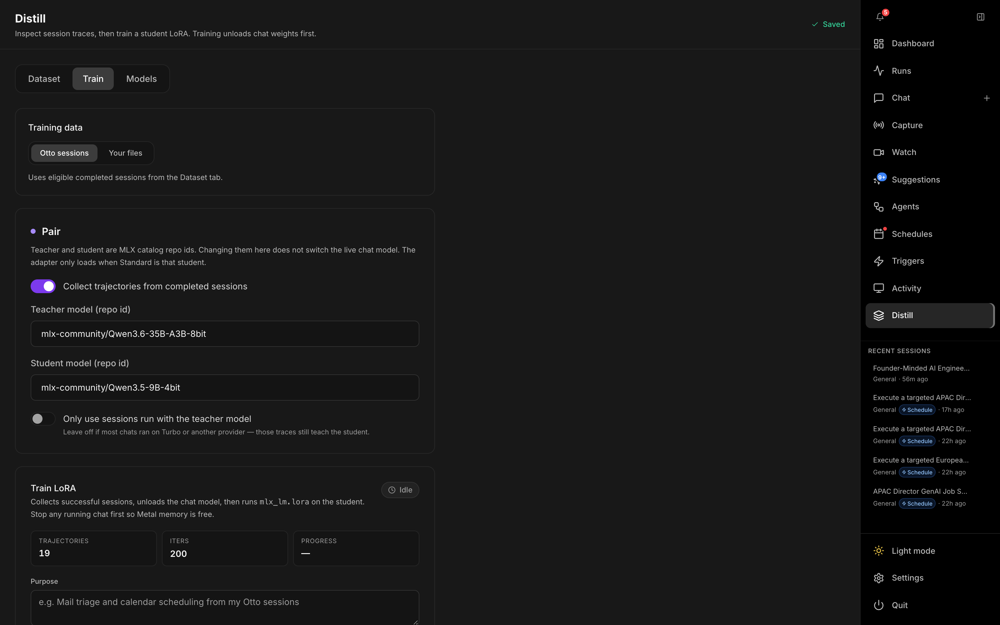
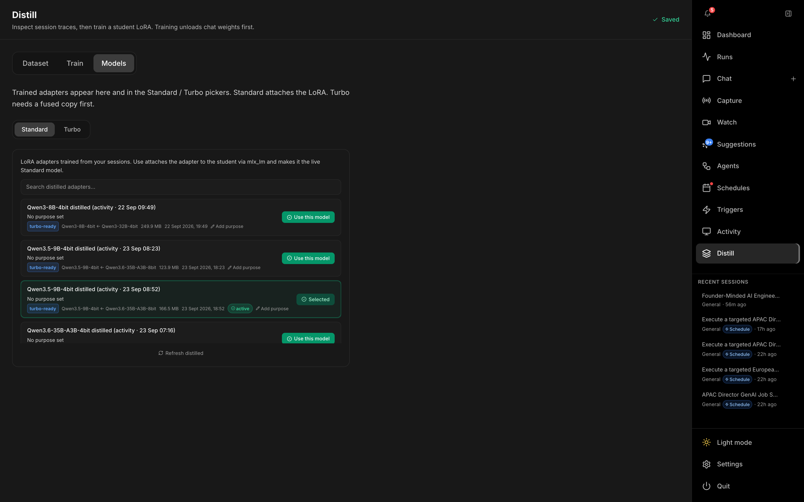

# Distill

The **Distill** page (`/distill`) trains a small on-device LoRA from traces Otto has already run, so a student model can follow tool-use patterns that a larger teacher got right. Open it from **Distill** in the right-hand nav. Training runs with `mlx_lm.lora` on Apple Silicon. It unloads the chat model first so Metal memory is free — stop any running chat before you start.

Changes on this page save automatically (a **Saving… / Saved** indicator sits in the header). The engineering notes behind the pipeline live in [`distillation.md`](distillation.md). This page is the walkthrough of the UI.

Three tabs: **Dataset**, **Train**, and **Models**.

---

## Dataset

Two sources.

**Otto sessions** scans completed chats. A session is eligible when it finished cleanly and used at least two tools (the `min_tool_calls` gate). The stat cards show eligible vs excluded counts, message and tool volume, sessions missing a model id, eval failures, and unanswered tool calls. Chips under the cards break those rejects down by reason (**Not completed**, **Ended in error**, **Too few tools**, **Wrong teacher**, **Eval failed**).

Filter the table with **All / Eligible / Excluded / Missing model / Unanswered / Eval fail**, or search by title, preview, session id, model, or tool name. Select a row to open the quality-gate detail and a link back to that chat.

**Your files** accepts a JSONL file (or a JSON array) you already have. Each row needs a `messages` array with at least one `user` turn and one `assistant` turn. ShareGPT `conversations` is accepted too. A validation card reports valid rows, invalid rows, and the first errors. **Use for train** selects that file as the training source.

---

## Train

**Pair** chooses the teacher and the student. Both are MLX catalog repo ids. Defaults are `mlx-community/Qwen3-32B-4bit` (teacher) and `mlx-community/Qwen3-8B-4bit` (student). Changing them here does not switch the live chat model. The adapter only loads when Standard is running that student.

| Control | Description |
|---|---|
| **Collect trajectories from completed sessions** | Master switch for turning finished chats into training rows. Off by default. |
| **Only use sessions run with the teacher model** | Restricts the dataset to chats whose model id matches the teacher. Leave off when most chats ran on Turbo or a cloud provider — those traces still teach the student. |
| **Training data** | **Otto sessions** (eligible chats) or **Your files** (the JSONL selected under Dataset). |
| **Iters** | LoRA training steps (default 200). |
| **Purpose** | A short note stored on the catalog card so you (and the agent) know when to load this adapter. |
| **Start training** | Disabled until at least one trace passes the quality filter, and while a chat session is still running. |
| **Refresh dataset** | Re-counts eligible traces. |

The job walks **Collecting trajectories → Preparing SFT dataset → Unloading chat model → Training LoRA**, and **Fusing for Turbo** when a fused copy is needed. A live log sits under the controls. Fewer than about 20 high-quality traces still trains, with a warning that the adapter is unlikely to be worth loading yet.

When training finishes, **Use this model** points Standard at the student plus this LoRA for the next chat.

---

## Models

Trained adapters are listed here and in the Standard / Turbo model pickers.

| Engine | What **Use** does |
|---|---|
| **Standard** | Attaches the LoRA to the student with `mlx_lm` and makes that the live Standard model. |
| **Turbo** | oMLX cannot load a LoRA sidecar. **Fuse & load in Turbo** writes a standalone model the size of the student (extra disk) and loads that into Turbo. |

Purpose text on a card can be edited from this tab.

---

## Related

- **[Settings → LLM → Standard](settings.md#standard)** — where the active adapter is attached for in-process MLX.
- **[Settings → LLM → Turbo](settings.md#turbo)** — where a fused copy is loaded.
- [`distillation.md`](distillation.md) — data format, quality gates, and training pipeline.
