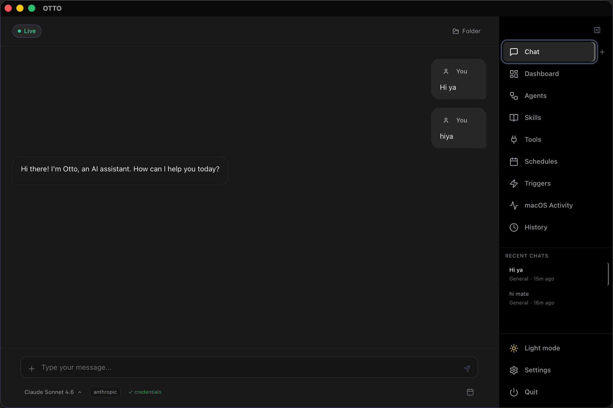
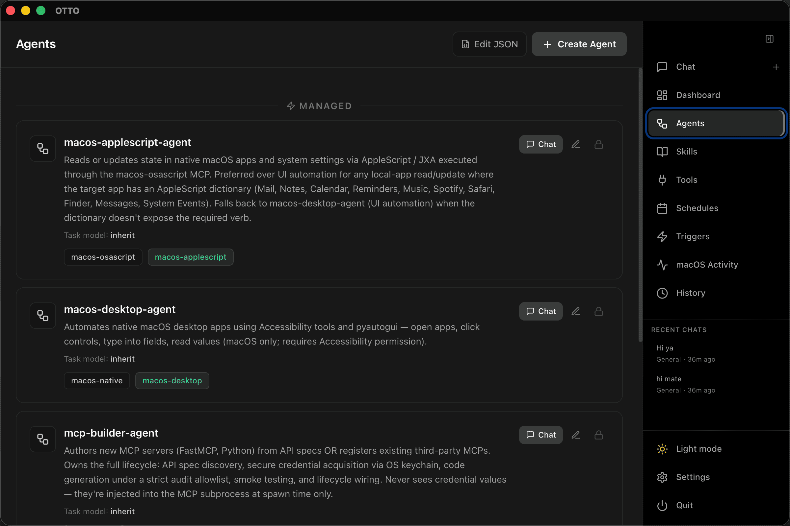
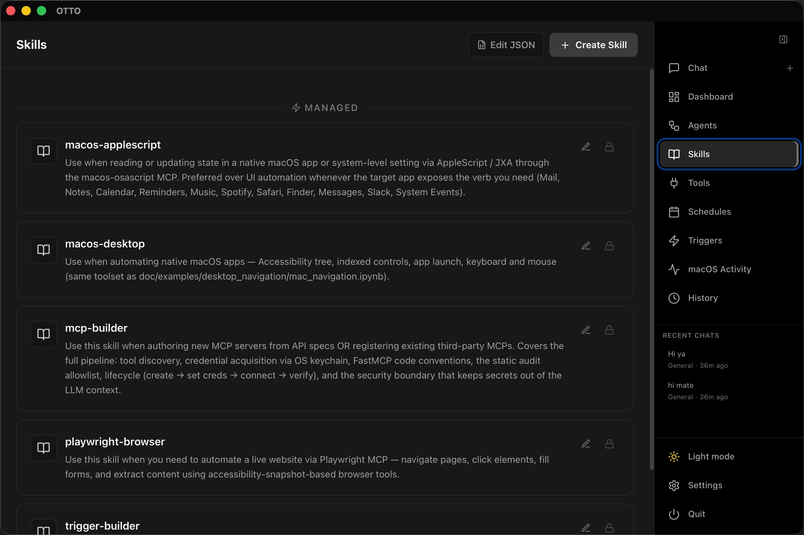
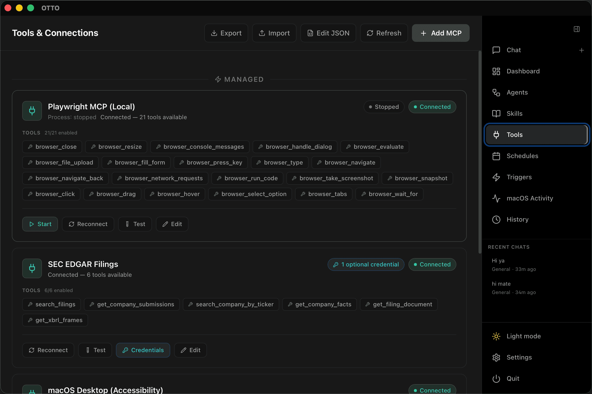
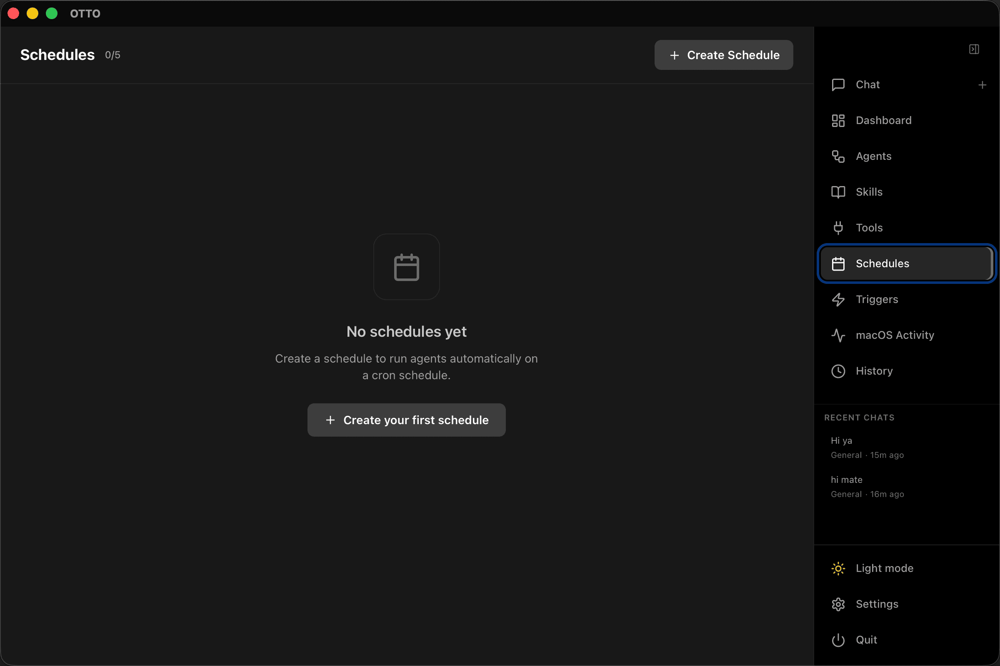
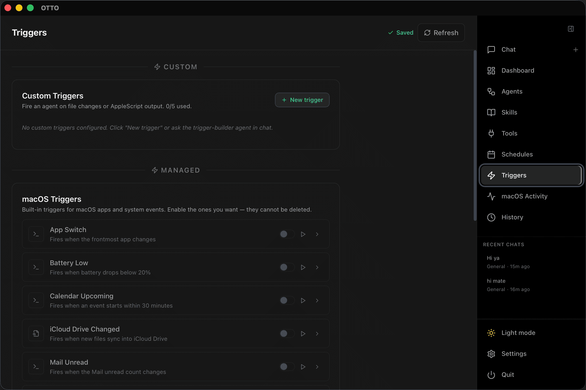
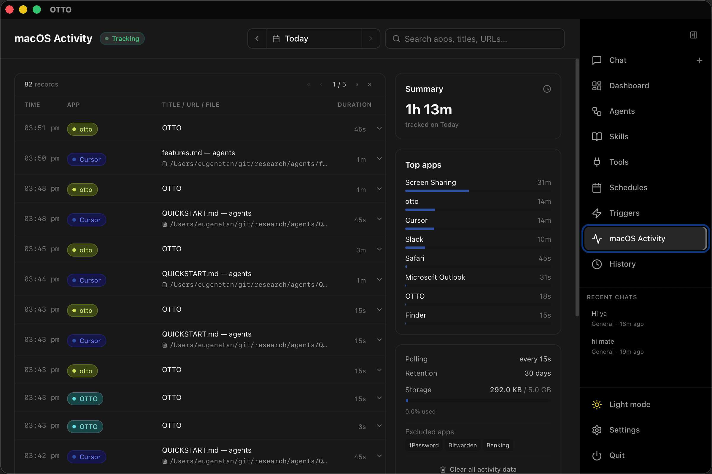
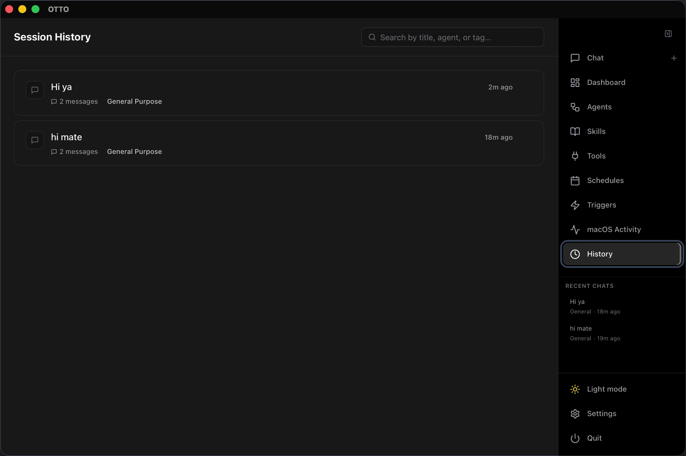

# Features

OTTO is a macOS AI agent desktop app that manages itself. Through conversation alone it creates and maintains its own **Agents**, **Skills**, **Tools**, **Schedules**, **Triggers**, and **Settings** — no config files, no manual setup.



---

## Table of Contents

1. [Agents](#agents)
2. [Skills](#skills)
3. [Tools](#tools)
4. [Schedules](#schedules)
5. [Triggers](#triggers)
6. [macOS Activity](#macos-activity)
7. [History](#history)

---

## Agents



Every conversation runs through a **DeepAgent** — a LangGraph ReAct graph that reasons over a configurable set of tools and subagents. Instead of a single monolithic model, work is broken up and dispatched to the right specialist automatically. Subagent tool calls and results stream back in real time, so you see the work in progress rather than waiting for a final answer.

Agents live in a persistent library. Each one has a name, a system prompt, an LLM selection, and a set of tools and skills. Switching agents in the UI rebuilds the graph for the next session — no restart needed. The library ships with ready-to-use built-ins and can grow with new entries created through conversation.

The orchestrator can spawn child sessions mid-run via `spawn_followup_session`, handing off to a fresh context when a task branches or new tools have just been wired up. Spawn chains are tracked (capped at depth 2) so the lineage is always visible in history.

**Built-in subagents**

| Subagent | What it does |
|---|---|
| `web-voyager` | Autonomous web navigation — plans, navigates, extracts |
| `computer-voyager` | macOS desktop automation via the Accessibility API |

On macOS, additional library agents are available for AppleScript and desktop automation. Off macOS they are hidden automatically.

### How to set up an agent

**Through chat (recommended)**

Ask the orchestrator directly:

> *"Create an agent called 'finance-researcher' with a system prompt focused on financial analysis. Give it the web-researcher tool and the edgar-sec MCP."*

The agent will call `create_agent` and the new entry appears in the library immediately.

**Through the UI**

Open **Settings → Agents**, click **New Agent**, fill in the name, system prompt, LLM family, tools, and skills, then save. The agent is available in the session selector straight away.

**Through the REST API**

```bash
curl -X POST http://localhost:18081/api/agents \
  -H "Content-Type: application/json" \
  -d '{
    "name": "finance-researcher",
    "description": "Focused on financial document analysis",
    "system_prompt": "You are a financial research assistant...",
    "tools": ["edgar-sec"],
    "skills": ["research-methodology"]
  }'
```

---

## Skills



A skill is a named **SKILL.md** document — YAML frontmatter and a body — that teaches the orchestrator when and how to apply a specific workflow or use a particular set of tools. Skills are reusable across agents; any agent that references a skill can read it and apply it during a run.

Rather than hardcoding behaviour into a system prompt, skills let you separate and compose techniques. A "competitive-research" skill, for instance, could describe a multi-step search-and-synthesise workflow that any agent in the library can call on. Skills can also document tool usage conventions, safety reminders, or output formats.

The library ships built-in skills (versioned and non-deletable) and supports an unlimited number of custom entries.

### How to set up a skill

**Through chat (recommended)**

> *"Create a skill called 'earnings-analysis' that describes how to pull and compare SEC filings across two or more companies."*

The orchestrator writes the SKILL.md, saves it to the library, and links it to any agents you specify.

**Through the REST API**

```bash
# Create
curl -X POST http://localhost:18081/api/skills \
  -H "Content-Type: application/json" \
  -d '{
    "name": "earnings-analysis",
    "content": "---\ntitle: Earnings Analysis\n---\n\nSteps to compare filings..."
  }'

# List
curl http://localhost:18081/api/skills

# Export / import the full library
curl http://localhost:18081/api/skills-config > skills-backup.json
curl -X POST http://localhost:18081/api/skills-config -d @skills-backup.json \
  -H "Content-Type: application/json"
```

**Attach to an agent**

Include the skill name in the agent definition (via chat, UI, or API). The orchestrator prompt instructs the model to read the SKILL.md and apply it when the context matches.

---

## Tools



Tools are the actions an agent can take during a run — web search, document reading, shell execution, browser automation, and more. Each tool is registered with the graph at session start; the agent selects and calls them as needed.

Beyond the built-ins, any **MCP server** (stdio or SSE) adds its tools to the session automatically when connected. The agent can also **author entirely new MCP servers at runtime** — writing the server code, provisioning a venv, auditing the source for unsafe imports and hardcoded secrets, registering it, and prompting you for credentials through a secure vault dialog before connecting.

**Built-in tools**

| Tool | What it does |
|---|---|
| `web_researcher` | Search + full-page extraction, returns structured markdown |
| `doc_researcher` | BM25 keyword ranking over uploaded documents — no embeddings |
| `doc_reader` | LLM-based document summarisation and Q&A |
| `wikipedia` | Wikipedia summary lookup |
| `duckduckgo` | DuckDuckGo web search — no API key needed |
| `playwright_mcp` | Browser automation via Playwright MCP (accessibility snapshots) |
| `execute` | Shell commands in a per-session sandbox |
| `ask_user` | Interrupt and ask the user a free-text or multiple-choice question |
| `spawn_followup_session` | Hand off to a fresh session after building new tools mid-turn |
| `view_image` | Let the agent interpret uploaded images |

**Built-in MCP servers** (auto-provisioned on startup)

| MCP | Tools |
|---|---|
| `edgar-sec` | Full read access to 18M+ SEC EDGAR filings |
| `macos-osascript` | Execute AppleScript snippets (macOS only) |
| `macos-mail` | CRUD + full-text search over Apple Mail via AppleScript (macOS only) |

Every tool call is wrapped with a loop guard that detects repeated identical-argument failures and injects a recovery hint. MCP results are scrubbed for known credential patterns before they reach the model context.

### How to set up tools

**Add an MCP server through chat**

> *"Build me a Stripe MCP that can list recent charges and create payment links."*

The agent writes the server, provisions its venv, registers it, then opens a vault dialog to securely collect your API key. All secrets are stored in the OS keychain and injected at subprocess spawn time — the model never sees the values.

**Add an MCP server through Settings**

Open **Settings → MCP Servers**, click **Add Server**, fill in the command, arguments, and environment variable names (not values — those go in the vault), then save. The server starts and its tools are available in the next session.

**Start the Playwright MCP** (required for browser automation)

```bash
npx -y @playwright/mcp@latest --port 8931
```

Then set in `.env`:

```bash
PLAYWRIGHT_MCP_HOST=localhost
PLAYWRIGHT_MCP_PORT=8931
PLAYWRIGHT_MCP_HEADLESS=false
```

---

## Schedules



Schedules run an agent on a cron expression automatically — no human trigger needed. Each schedule pairs a cron string, an agent, and a prompt. When it fires, a full session is created, the prompt is streamed in, and the run is recorded in the schedule's history. Results land in `<app-data>/schedules/<id>/runs/` with a symlink at `latest/` for easy access.

Up to five schedules can run concurrently. They survive backend restarts and self-heal stale `running` state on startup.

Example use cases: daily news summaries into memory, weekly SEC filing digests, overnight research runs.

### How to set up a schedule

**Through chat (recommended)**

> *"Create a schedule that runs every weekday at 9am, uses the finance-researcher agent, and summarises top AI news into my memory."*

The orchestrator translates your intent into a cron expression and calls `create_schedule`.

**Via `create_schedule` tool parameters**

| Parameter | Description |
|---|---|
| `cron_expression` | Standard 5-field cron (e.g. `0 9 * * 1-5`) |
| `prompt` | What to ask the agent each run |
| `agent_name` | Agent from the library (or default orchestrator if omitted) |
| `enabled` | Start enabled or paused |
| `keep_last_n_runs` | How many run records to keep (default: 10) |
| `timeout_seconds` | Max run duration (default: 86400 — 24 h) |

**Manage via the REST API**

```bash
# List all schedules
curl http://localhost:18081/api/schedules

# Pause a schedule
curl -X POST http://localhost:18081/api/schedules/<id>/toggle

# Fire immediately (outside cron window)
curl -X POST http://localhost:18081/api/schedules/<id>/run-now

# Delete
curl -X DELETE http://localhost:18081/api/schedules/<id>
```

---

## Triggers



Triggers watch for something to change and fire an agent run when it does. Unlike schedules, they are **event-driven** — the agent wakes up in response to the world, not a clock.

Each trigger polls at a configurable interval, records a watermark of what it last saw, and only fires when the state changes. That watermark persists across restarts, so events don't replay after a backend bounce.

**Trigger types**

| Type | What it watches |
|---|---|
| `fileos` | A filesystem path — modes: `mtime`, `size`, `exists`, `new_files` |
| `macostool` | Runs an AppleScript snippet on a timer; fires when the output changes (optional regex gate) |
| `http` | Polls an HTTP endpoint (privileged — requires `trigger-builder-agent`) |
| `git` | Watches a git ref (privileged) |
| `shell` | Runs a shell command and reacts to output changes (privileged) |

**Built-in catalog triggers** (opt-in, disabled by default)

- New file in `~/Downloads`
- New screenshot in `~/Desktop` or `~/Pictures/Screenshots`
- Mail unread count change

Built-in catalog entries don't count toward the five-trigger limit.

When a trigger fires, it passes the event payload as a JSON block appended to the prompt so the agent knows exactly what changed.

### How to set up a trigger

**Through chat (recommended)**

> *"Watch ~/Downloads for new PDFs and, when one appears, extract the title and first paragraph into my notes."*

The orchestrator creates a `fileos` trigger with mode `new_files` and the prompt you described.

**Via `create_trigger` tool parameters**

| Parameter | Description |
|---|---|
| `type` | `fileos` or `macostool` (others require privileged agent) |
| `name` | Human-readable label |
| `prompt` | What to ask the agent when the trigger fires |
| `agent_name` | Agent to use (default orchestrator if omitted) |
| `poll_interval_seconds` | How often to check (e.g. `60`) |
| `path` | (fileos) Filesystem path to watch |
| `mode` | (fileos) `mtime` \| `size` \| `exists` \| `new_files` |
| `script` | (macostool) AppleScript snippet to evaluate |
| `regex` | (macostool) Optional pattern the output must match before firing |

**Manage via the REST API**

```bash
# List all triggers
curl http://localhost:18081/api/triggers

# Fire a trigger immediately (for testing)
curl -X POST http://localhost:18081/api/triggers/<id>/run-now

# Pause
curl -X POST http://localhost:18081/api/triggers/<id>/toggle

# Delete
curl -X DELETE http://localhost:18081/api/triggers/<id>
```

---

## macOS Activity



The activity tracker is an opt-in, screenshot-free local timeline of your Mac. A background loop polls the foreground application every N seconds and records `(app name, window title, browser URL, active document)` into a local SQLite database with FTS5 full-text indexing. Nothing leaves the device. Consecutive identical rows are deduplicated into a single span with a running duration field.

The agent can query this timeline during a run — surfacing what you were working on before asking a question, finding recently opened documents, or building context-aware summaries without you having to explain your setup.

Requires **Accessibility permission** in System Settings. Without it the tracker soft-fails silently and activity tools return empty guidance rather than an error.

### How to enable and configure

**Enable through chat**

> *"Enable the activity tracker and set it to poll every 30 seconds."*

The orchestrator calls `update_activity_settings(enabled=True, interval_secs=30)`.
The tracker re-reads its config on every poll cycle, so changes take effect
within one `interval_secs` of the call — no restart needed.

**Enable through Settings**

Open *Settings → macOS Activity* in the app and toggle the master switch.
The same JSON config (`~/Library/Application Support/Otto/config.json`,
key `activity`) backs the tool, the REST API, and the UI — there is one
authoritative source of truth, not three.

```jsonc
// ~/Library/Application Support/Otto/config.json
"activity": {
  "enabled": true,
  "interval_secs": 30,
  "retain_days": 90,
  "exclude_apps": ["Keychain Access", "1Password"]
}
```

**Grant Accessibility permission**

1. Open **System Settings → Privacy & Security → Accessibility**
2. Add the OTTO app (or your terminal if running from source)
3. Restart the backend — the tracker will pick up the permission

**Query activity via the REST API**

```bash
# Recent activity
curl "http://localhost:18081/api/activity?limit=50"

# Full-text search
curl "http://localhost:18081/api/activity?q=Figma&limit=20"

# Status and config
curl http://localhost:18081/api/activity/status
```

**Activity tools available to agents** (injected automatically when enabled)

| Tool | What it does |
|---|---|
| `search_screen_history` | FTS search over recorded app/window/URL/document rows |
| `list_recent_apps` | Apps used in the last N minutes |
| `activity_summary` | Summarise activity over a time window |

---

## History



Every session produces three layers of record, each serving a different purpose.

**Session metadata** — a lightweight JSON file per session (`<app-data>/sessions/<id>.json`) recording the agent used, start time, status, and provenance fields: `trigger_source`, `trigger_id`, `schedule_id`, `parent_session_id`, and `chain_depth`. The UI session list is built from these files.

**UI message history** — a newline-delimited JSON file per session (`<id>.messages.json`) holding the conversation as displayed in the chat window. Tool results are truncated to 500 characters to keep the file compact.

**Full transcripts** — an append-only JSONL file per session (`<app-data>/transcripts/<id>.jsonl`) recording every message with full content, UTC timestamps, role, and tool metadata. These are the source of truth for the memory consolidation pipeline and any post-run analysis.

**LangGraph checkpoint** — graph state is checkpointed into `<app-data>/sessions/checkpoints.sqlite` via `AsyncSqliteSaver`, enabling mid-run recovery and state inspection.

**Memory consolidation** — a background pipeline distils session transcripts into durable topic files under `<app-data>/memory/`:

1. **Orient** — read the `MEMORY.md` index and topic frontmatter
2. **Gather** — collect candidate transcript JSONL files since last consolidation
3. **Consolidate** — LLM call produces structured memory diffs
4. **Prune** — enforce per-topic and index size limits

### How to access history

**In the UI**

Open the **History** panel to browse past sessions. Clicking a session loads its message history. Scheduled and trigger-fired runs show their provenance (which schedule or trigger created them).

**Via the REST API**

```bash
# List sessions (most recent first)
curl http://localhost:18081/api/sessions

# Get messages for a session
curl http://localhost:18081/api/sessions/<session-id>/messages

# Memory consolidation status
curl http://localhost:18081/api/memory/status

# Trigger a consolidation run
curl -X POST http://localhost:18081/api/memory/consolidate
```

**Schedule and trigger run history**

Each schedule keeps per-run records under `<app-data>/schedules/<id>/runs/` with a `latest/` symlink to the most recent run. Trigger runs are linked back to the session via `trigger_id` in the session metadata.
