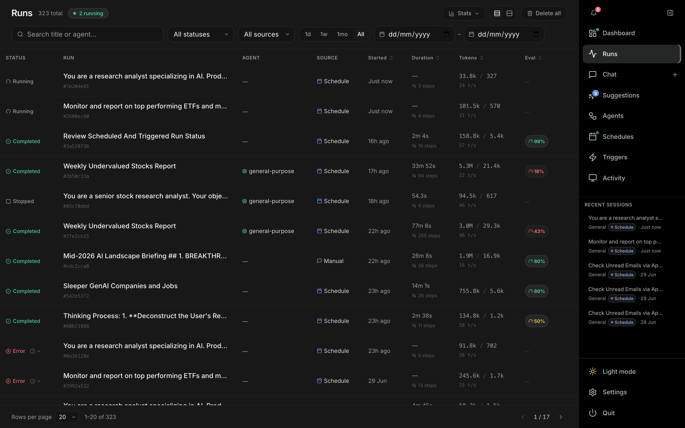
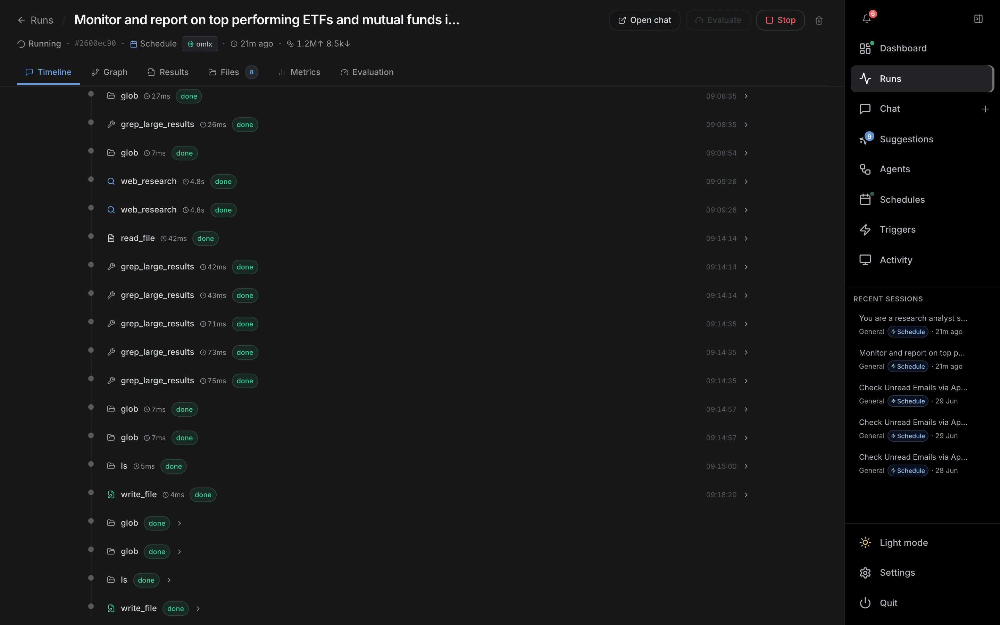
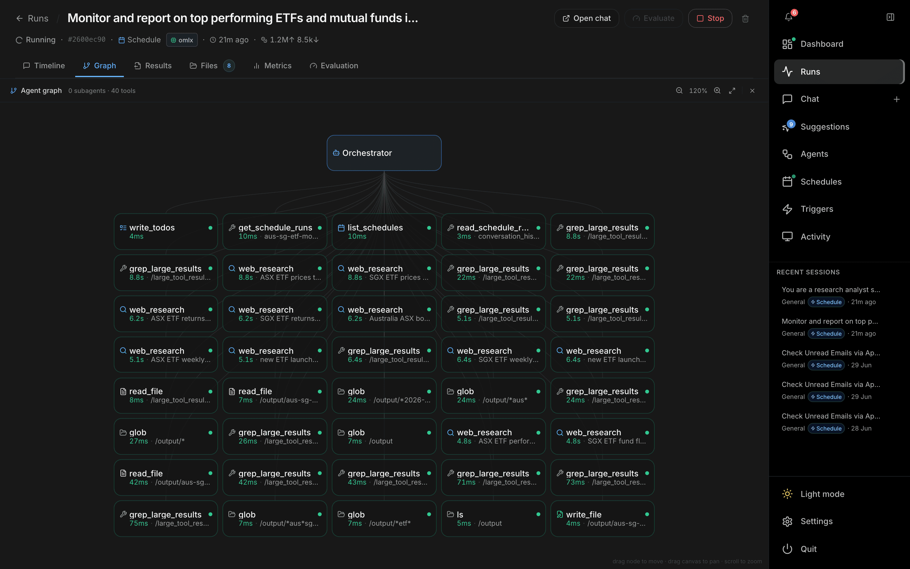
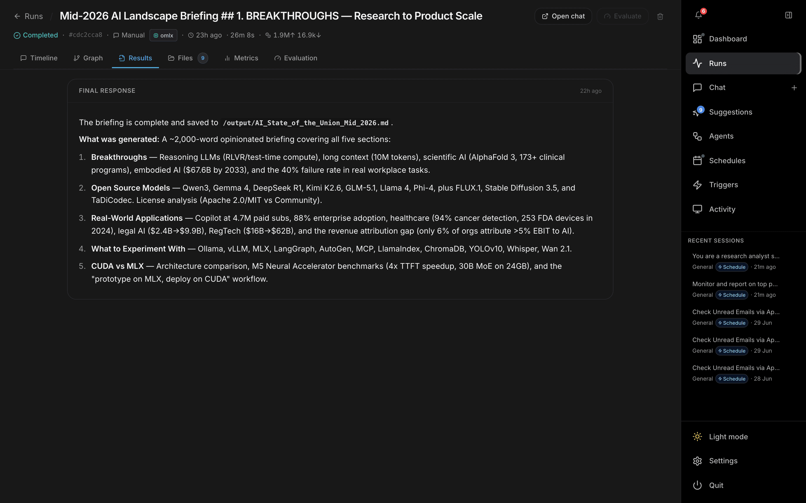
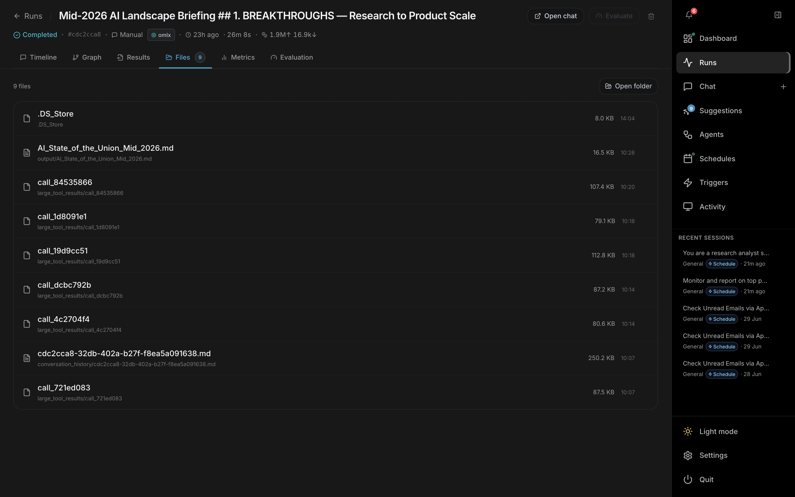
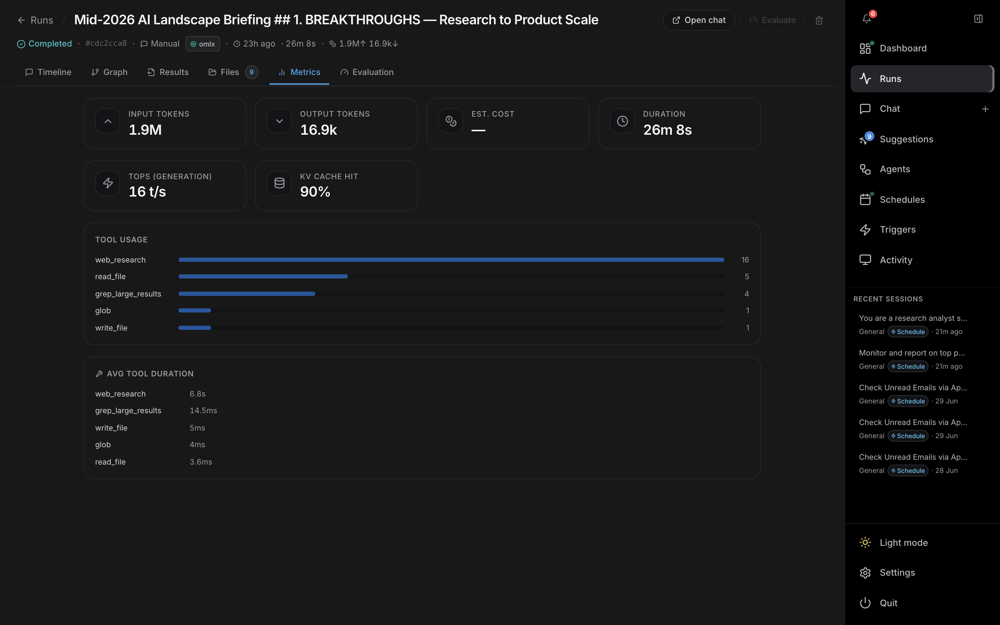
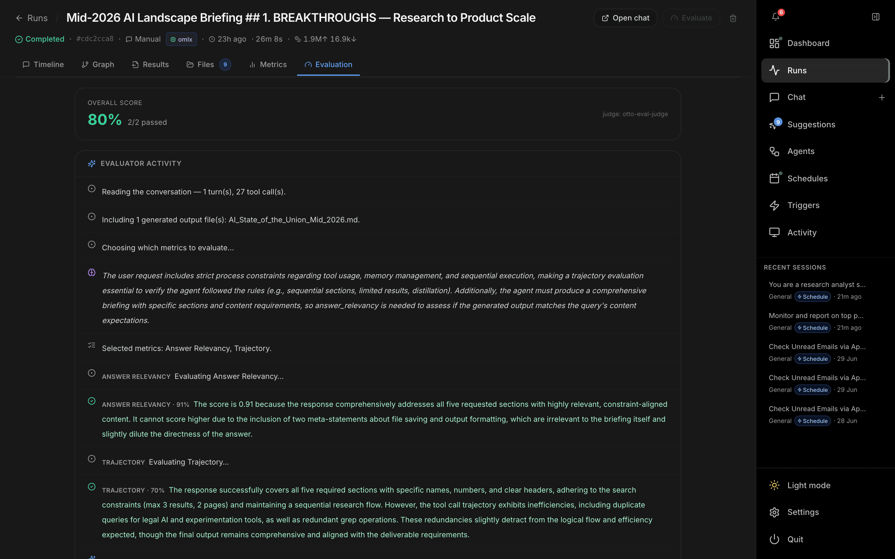

# Runs

The **Runs** page (`/runs`) is the searchable history of every agent run — manual chats, scheduled jobs, triggers, ambient/voice sessions. Open it from **Runs** in the right-hand nav. The list polls for updates so in-progress runs stay current.

---

## Header

| Control | Description |
| --- | --- |
| **Runs** title | Shows the total count and a green **N running** pill when runs are active. |
| **Stats** | Toggles a strip of aggregate cards (see below). The open/closed state is remembered. |
| **Density** | Toggle between *comfortable* and *compact* rows. |
| **Delete all** | Removes every session and run (click twice to confirm). |

## Filters

All filters are saved to local storage and reflected in the URL, so a filtered view can be bookmarked or shared.

- **Search** — match by run title or agent name (debounced).
- **Status** — All / Running / Completed / Error / Stopped / Awaiting input.
- **Source** — All / Manual / Schedule / Trigger / Ambient / Voice.
- **Quick date chips** — `1d` · `1w` · `1mo` · `All`.
- **Custom date range** — explicit *from* / *to* date inputs.
- **Clear** — appears when any filter or search is active.

## Stats strip

When **Stats** is on, a row of cards shows for the current filter: **Total runs**, **Success rate**, **Avg duration**, **Avg steps / run** (with total steps), and **Running now**.

## Run table

| Column | Notes |
| --- | --- |
| **Status** | Running / Completed / Error / Stopped, with a colored indicator. |
| **Run** | Title plus a short `#id`. |
| **Agent** | Agent that handled the run (or — for orchestrator). |
| **Source** | Schedule / Trigger / Manual / Ambient / Voice with an icon. |
| **Started** | Relative start time. |
| **Duration** | Wall-clock time and step count. |
| **Tokens** | Tokens in/out and throughput (t/s). |
| **Eval** | Evaluation score badge, color-coded by score. |

`Started`, `Duration`, `Tokens`, and `Eval` are sortable. Each row has hover actions to delete or re-run, and clicking a row opens the **run detail** view (see below). The footer provides rows-per-page (20 / 50 / 100) and page navigation.

---

## Run detail

Clicking a run opens its detail page (`/runs/:id`). The header shows a **Runs** back link, the run title, and actions — **Open chat**, **Evaluate** (disabled when auto-evaluation is on), **Stop** (while running), and delete. A meta row beneath shows status, short id, source (clickable to the parent schedule/trigger run history), agent, model/provider chip, start time, duration, tokens, and cost.

The body is split into six tabs, each deep-linkable with `?tab=`:

| Tab | Contents |
| --- | --- |
| **Timeline** | The full event stream — agent turns, tool calls, and tool results with per-step durations and `done` badges. While the run is live it streams in and stays pinned to the latest step. |
| **Graph** | An interactive agent graph: the orchestrator node branching into every tool call and subagent delegation (with counts, durations, and arguments). Pan/zoom; empty when a run has no tool calls. |
| **Results** | The agent's **Final response** rendered as Markdown, plus a collapsible history of earlier turns when there was more than one. |
| **Files** | Files written during the run, with size and time. Click to preview inline (text, code, Markdown, images, HTML), download individual files, or **Open folder** on disk. The tab shows a count badge. |
| **Metrics** | Token, cost, and duration cards; MLX throughput tiles (TIPS / TOPS / KV cache hit / peak GPU) when available; **Tool usage** counts; and **Avg tool duration**. |
| **Evaluation** | The run's score. See below. |

### Timeline

### Graph

### Results

### Files

### Metrics

### Evaluation

Shows the **Overall score**, pass count, and judge model, followed by a live **Evaluator activity** trace (reading the conversation, choosing metrics, then scoring each one) and per-metric cards (e.g. Answer Relevancy, Trajectory) with score bars, pass/fail badges, thresholds, and the judge's reasoning. When a run scores below threshold, a **Suggested prompt improvement** panel offers to re-run with the improved prompt, update the source schedule/trigger prompt, or view it in [Suggestions](suggestions.md). Failed runs show an **Error analysis** instead. Evaluation runs automatically when auto-evaluation is enabled, or on demand via the **Evaluate** button.

