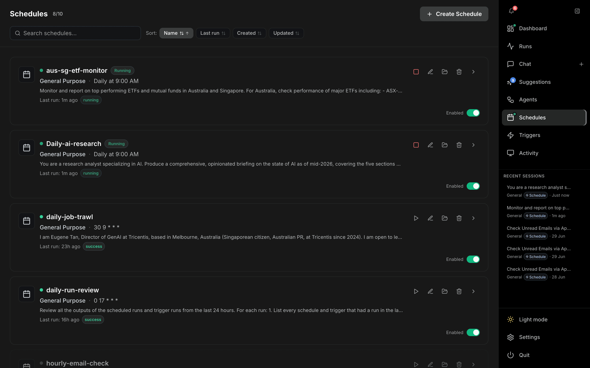

# Schedules

The **Schedules** page (`/schedules`) lets you run agents automatically on a cron schedule. Open it from **Schedules** in the right-hand nav. (The nav remembers the last schedule detail you viewed and returns you there.)

---

## Header

| Control | Description |
| --- | --- |
| **Schedules** title | Shows the enabled/total count (e.g. `8/10`). |
| **Search** | Filter schedules by name. |
| **Sort** | By **Name**, **Last run**, **Created**, or **Updated** (click again to flip direction). |
| **Create Schedule** | Opens the schedule editor. |

## Schedule cards

Each card shows the schedule name, agent, a human-readable cadence (e.g. *Daily at 9:00 AM*) alongside the raw cron, the prompt summary, and the last run with its outcome (`running` / `success` / failure). A status dot indicates running/failed state.

| Card action | Description |
| --- | --- |
| **Run now** (play) | Triggers an immediate run. A running schedule shows a stop control instead. |
| **Edit** (pencil) | Opens the editor. |
| **Folder** | Opens the schedule's files folder. |
| **Delete** (trash) | Removes the schedule. |
| **Enabled toggle** | Turns the schedule on/off without deleting it. |
| **›** (chevron) | Opens the run history (`/schedules/:id/runs`). |

## Schedule editor

The Create/Edit dialog provides:

- **Name**.
- **Prompt** — what the agent should do each time it runs.
- **Cadence** — quick cron **presets** plus a custom cron expression field (with the resolved cron shown beneath).
- **Attachments** — files stored once per schedule and exposed read-only to every run under `/attachments/`.

## Run history

The chevron opens a detail page listing every past run of that schedule, so you can inspect outcomes, durations, and open individual runs.
