# Settings

Settings are accessible from the bottom of the left nav. All changes save automatically — no Apply button (a small **Saving… / Saved** indicator appears top-right).

Settings can also be changed through conversation:

> *"Switch to claude-opus-4-5 and enable extended thinking."*
> *"Turn on activity tracking with a 30-second poll interval."*
> *"Enable LangSmith tracing."*

---

## Table of Contents

1. [LLM](#llm)
   - [Model Provider](#model-provider)
   - [Frontier](#frontier)
   - [Standard](#standard)
   - [Turbo](#turbo)
   - [Cluster](#cluster)
2. [Agent Memory](#agent-memory)
   - [Status](#status)
   - [Topics](#topics)
   - [Search Index](#search-index)
   - [Configuration](#configuration)
3. [Suggestions](#suggestions)
4. [macOS Activity](#macos-activity)
5. [Voice](#voice)
6. [Advanced](#advanced)
7. [Observability](#observability)
8. [Privacy & Security](#privacy--security)
9. [About](#about)

---

## LLM

Controls which models run the agent and the internal orchestrator. Credentials are stored in the OS keychain — never in config files. All API keys are kept in a single keychain entry (`otto.app` / `__app_secrets__`), so saving them prompts for keychain access at most once.

> **Repeated keychain password prompts?** macOS ties keychain access to an app's code signature. If you see the password prompt several times, the `otto.app` / `otto.mcp` entries were almost certainly created earlier by a *different* identity — most often by running the backend in development (`.venv` Python) or a previous build — so the installed app is "foreign" to those entries and re-prompts per item. One-time fix: open **Keychain Access**, search for `otto.`, delete the matching entries, then relaunch OTTO and re-enter your keys. The signed app then re-creates and owns a single consolidated entry and won't prompt again.

The LLM section has five sub-tabs: **Model Provider**, **Standard** (in-process MLX), **Turbo** (oMLX server), **Cluster** (exo), and **Frontier** (cloud). The four inference stacks each keep their own credentials and cache paths, so you can switch the active provider without re-entering anything.

### Model Provider

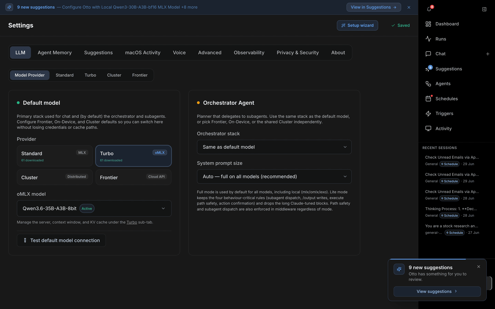

Two cards side by side.

**Default model** — the stack used for chat and (by default) all subagents. Pick a provider from the chip group; the relevant model picker appears below it.

| Provider chip | Backed by | Notes |
|---|---|---|
| Standard | On-device MLX (in-process) | Apple Silicon, no API key |
| Turbo | On-device oMLX server | Paged KV cache + continuous batching, no API key |
| Cluster | Distributed exo | Multiple Apple Silicon nodes |
| Frontier | Cloud API | Anthropic or OpenAI |

| Option | Description |
|---|---|
| Provider | `Standard`, `Turbo`, `Cluster`, or `Frontier` (chips show how many models are downloaded) |
| Model | The active model for the chosen provider (Frontier shows **Fetch models** to list IDs your key can call) |
| Test default model connection | Sends a live ping to verify credentials and connectivity |

**Orchestrator Agent** — the planner that delegates to subagents. Can run on a different stack from the default model.

| Option | Description |
|---|---|
| Orchestrator stack | `Same as default model`, `Frontier`, `OpenAI`, `On-Device`, or `Cluster` |
| Orchestrator MLX repo / model type | Optional overrides shown when the stack is On-Device |
| System prompt size | `Auto` (full on all models), `Full` (~1.7K tokens, Claude-tuned), or `Lite` (~300 tokens, OSS-friendly) |

---

### Frontier

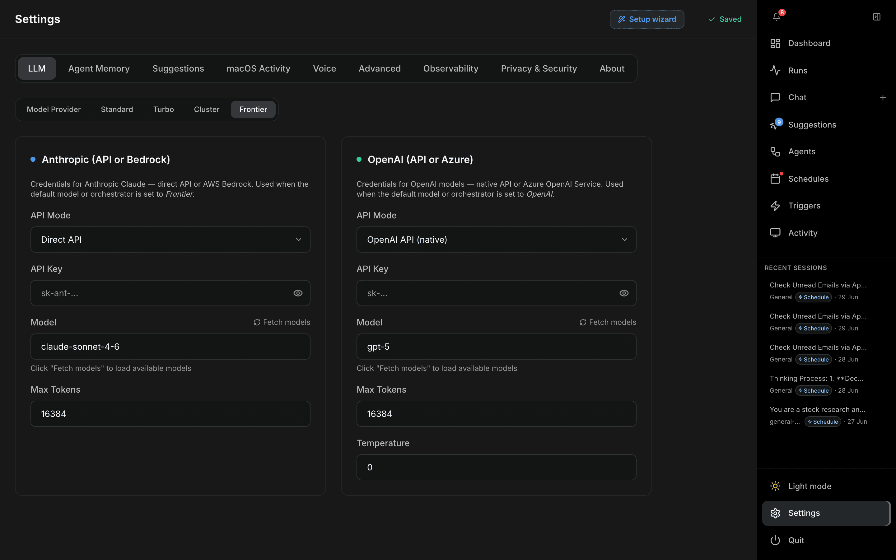

Credentials and model selection for cloud providers. Used when the default model or orchestrator is set to *Frontier* / *OpenAI*.

**Anthropic (API or Bedrock)**

| Option | Description |
|---|---|
| API Mode | `Direct API` or `AWS Bedrock` |
| API key | Anthropic API key (direct mode) |
| AWS credentials | Access Key ID, Secret Access Key, and Region (Bedrock mode) |
| Model | Model ID — click **Fetch models** to load IDs your account can call |
| Max Tokens | Output token cap (default 8,192) |

**OpenAI (API or Azure)**

| Option | Description |
|---|---|
| API Mode | `OpenAI API (native)` or `Azure OpenAI Service` |
| API key / Azure credentials | Key, or Azure API key + endpoint + deployment + API version |
| Model | Model ID (Fetch models to list) |
| Max Tokens | Output token cap (default 16,384) |
| Temperature | Sampling temperature |

---

### Standard

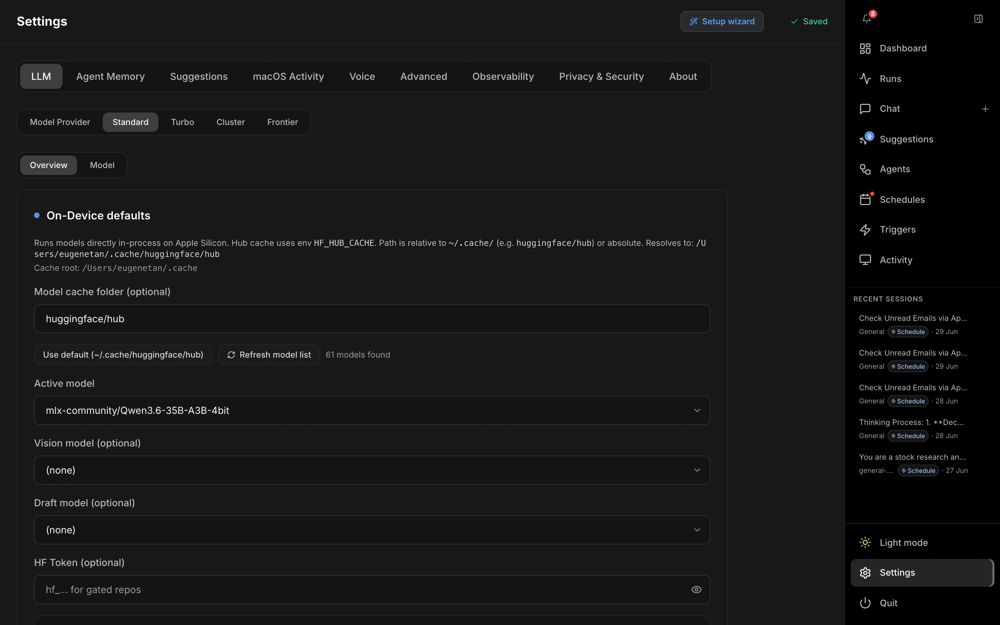

In-process local inference via [MLX](https://github.com/ml-explore/mlx) on Apple Silicon. No API key needed. Two sub-pills: **Overview** (defaults) and **Model** (browse / download from Hugging Face Hub).

**Models**

| Option | Description |
|---|---|
| Model cache folder | Hub cache path (env `HF_HUB_CACHE`); relative to `~/.cache/` or absolute |
| Active model | Hugging Face repo ID for the main LLM |
| Vision model | Optional VLM repo ID |
| Draft model | Optional speculative-decoding draft model |
| HF Token | Hugging Face token for gated repos |

**Generation & KV cache** (map to `MLX_*` environment variables)

| Option | Description |
|---|---|
| Max tokens | Output token cap (default 8,192) |
| Temperature | Sampling temperature |
| Repetition penalty | Default 1.1 |
| KV cache bits | `Full precision`, `4-bit KV`, or `8-bit KV` |
| KV group size | Quantisation group size (32 / 64 / 128) |
| KV cache cap (tokens) | Caps how large the attention cache grows; default 32,768 (≈1 GB on a 7B 4-bit model). `0` = unbounded |
| Verbose MLX logging | Logs Thought/Action/Observation traces |
| Chain-of-thought thinking | Enable thinking tokens (Qwen-style models) |
| KV prompt cache across turns | Reuse the KV cache between turns for faster responses |
| Reuse static system/tool prefix | Cache the unchanging system/tool prefix (requires prompt cache) |

The **Model** sub-pill opens a browser to search, download, and select models from Hugging Face Hub — shared with the Turbo tab.

---

### Turbo

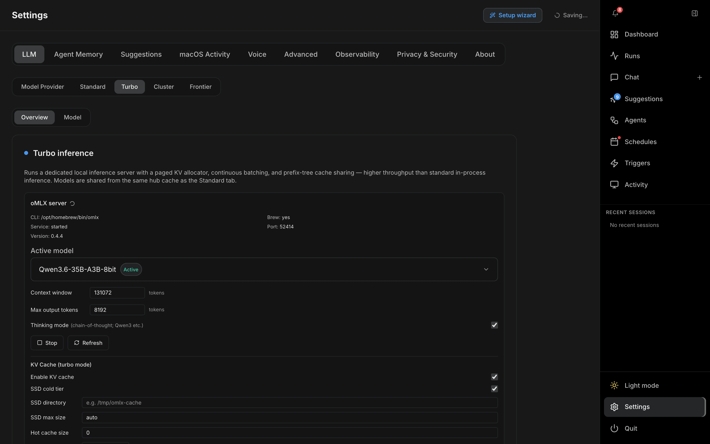

A dedicated local inference server ([oMLX](https://github.com/exo-explore/omlx)) with a paged KV allocator, continuous batching, and prefix-tree cache sharing — higher throughput than Standard in-process inference. Models share the same Hub cache as the Standard tab. Two sub-pills: **Overview** and **Model**.

**Server**

| Control | Description |
|---|---|
| Status | Shows CLI path, Homebrew, service state, port, and installed/latest version |
| Install / Start / Stop / Refresh | Install oMLX (Homebrew or direct release), or start/stop the local server |
| Active model | Model loaded into the running server (or saved to load on next start) |
| Context window | Max context window in tokens (default 131,072) |
| Max output tokens | Output token cap (default 8,192) |
| Thinking mode | Chain-of-thought for Qwen3-class models |

**KV Cache (turbo mode)**

| Option | Description |
|---|---|
| Enable KV cache | Keep the paged KV cache between requests |
| SSD cold tier | Spill the cache to disk when it exceeds RAM |
| SSD directory | Cache directory (e.g. `/tmp/omlx-cache`) |
| SSD max size | Max disk to use (e.g. `20GB` or `auto`) |
| Hot cache size | RAM cap for the hot tier (`0` = unlimited) |
| Initial blocks | KV blocks pre-allocated on start |
| Batch size | Continuous-batching concurrency cap (default 8) |

---

### Cluster

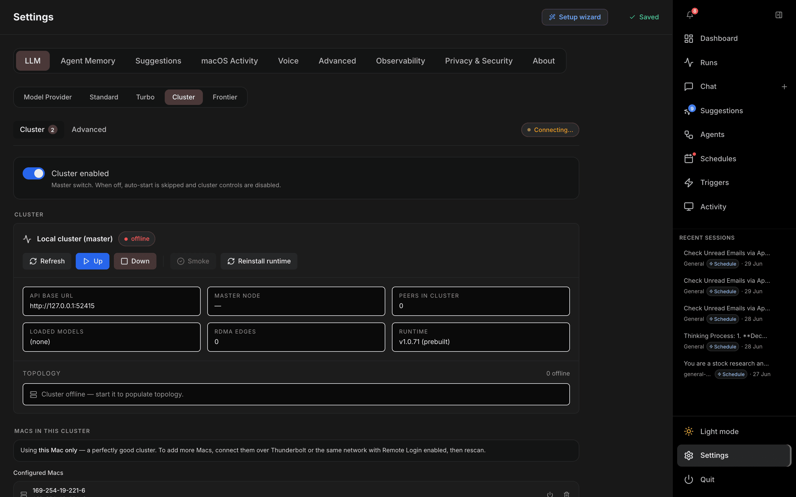

Distributed inference across multiple Apple Silicon nodes using [exo](https://github.com/exo-explore/exo). A live status badge (top-right) shows whether the daemon is reachable and how many nodes/models are loaded. Two sub-tabs: **Cluster** and **Advanced**.

**Cluster**

Master **Cluster enabled** switch, a guided setup flow, and the list of **remote nodes**. Add SSH aliases for other Apple Silicon / Linux machines; the app probes, generates keys, provisions, and starts the remote daemon. Each node shows its chip, free memory, and whether it has joined the cluster.

**Advanced**

| Option | Description |
|---|---|
| Runtime source | `Prebuilt` binary URL or build from `Source` |
| Repo URL / Repo ref | exo git repo and tag/branch/sha (build-from-source) |
| API port | Default 52415 |
| libp2p port | Default 0 (OS-assigned) |
| Base URL override | Override the cluster endpoint (blank = derived from API port) |
| Auto-start on boot | Start the local daemon and enabled remotes when the backend boots |
| Auto-provision dependencies | Auto-install prerequisites (brew / uv / node / rust) when setting up nodes |
| Skip Terminal.app wrapper | Advanced — only for signed builds with Local-Network privacy |

The default cluster model ID and exo placement strategy (sharding / instance metadata) are also set here; browse and preload models from the Catalog.

---

## Agent Memory

A background pipeline that distils session transcripts into durable topic files under `<app-data>/memory/`. The agent reads these files at the start of each session (and optionally on every turn) to maintain context across conversations. Four sub-chips run across the top: **Status**, **Topics**, **Search Index**, and **Configuration**. A status row under the chips shows the consolidation state (Idle / Running) and a live Save indicator.

### Status

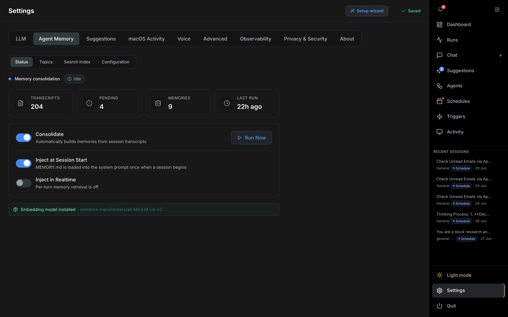

The dashboard for the consolidation pipeline. Stat cards show transcript count, pending files, memory count, and last run time. An **Embedding model installed** banner and a **Memory Hits** panel (which topics get injected most) appear here too.

| Control | Description |
|---|---|
| Consolidate toggle | Enable the background consolidation pipeline |
| Run Now / Cancel | Trigger (or stop) an immediate consolidation run |
| Inject at Session Start | Load `MEMORY.md` into the system prompt when a session opens |
| Inject in Realtime | A ranking model picks relevant memories each turn and injects them on the fly |

### Topics

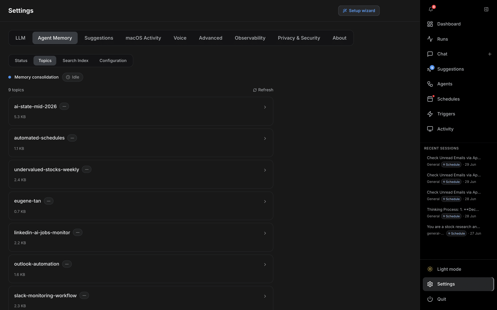

Browse every topic file the pipeline produced, with its size. Click a row to read and edit the topic; **Refresh** re-scans the memory directory. These are the durable `<topic>.md` files the agent loads for context.

### Search Index

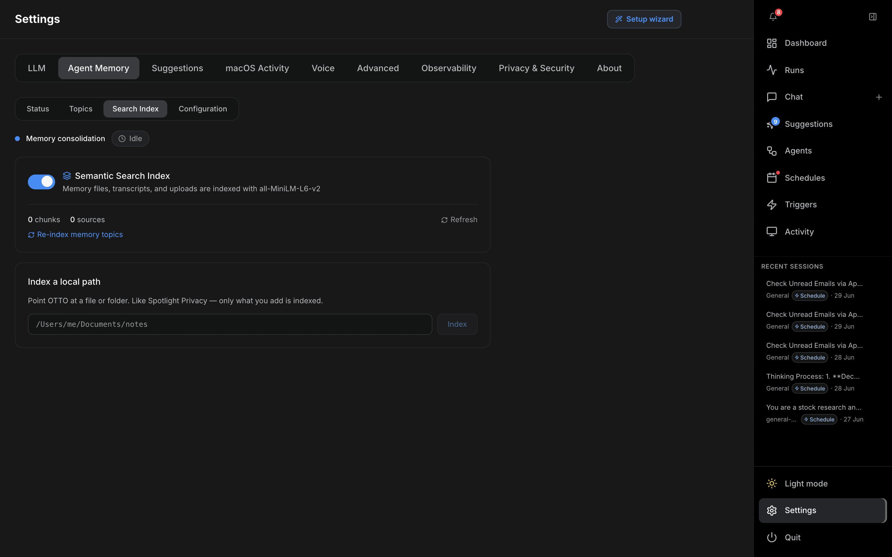

Semantic (vector) search over memory files, transcripts, and any local paths you add.

| Option | Description |
|---|---|
| Semantic Search Index toggle | Index content with `all-MiniLM-L6-v2` embeddings (off = BM25 keyword search only) |
| Chunks / sources | Live counts of indexed chunks and source files |
| Re-index memory topics | Rebuild the embedding index from scratch |
| Index a local path | Point OTTO at a file or folder to index (Spotlight-style — only what you add is indexed) |
| Indexed Sources | List of indexed sources with chunk counts; remove individually |

### Configuration

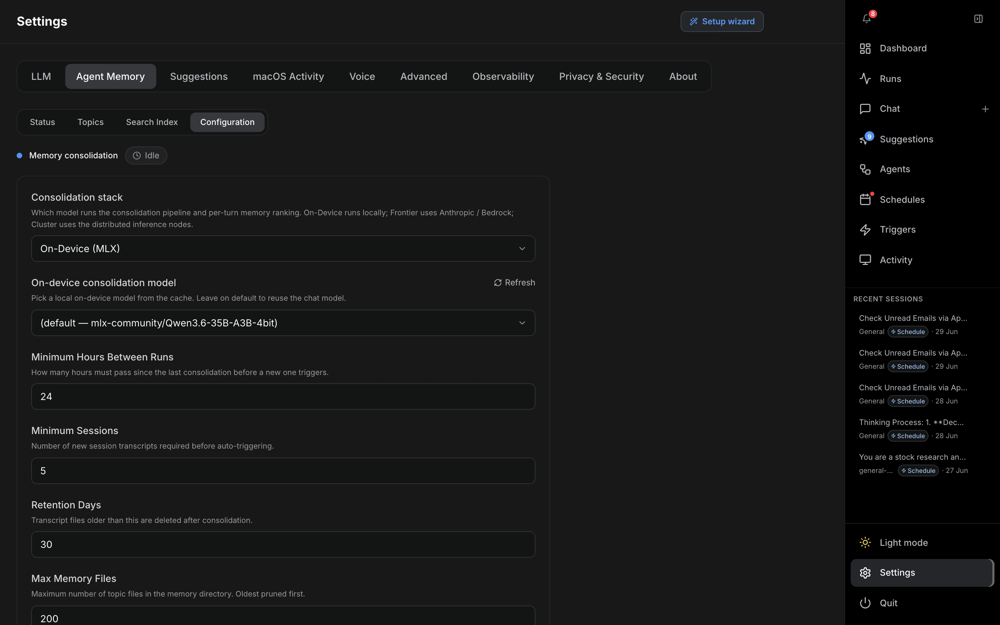

| Option | Description |
|---|---|
| Consolidation stack | Which stack runs consolidation and per-turn ranking (`Follow main`, `Frontier`, `On-Device (MLX)`, `Cluster`) |
| On-device consolidation model | Local model from the cache when the stack is MLX — leave on default to reuse the chat model |
| Model | Specific cloud model for consolidation when the stack is Frontier (Haiku-class recommended for cost) |
| Minimum Hours Between Runs | Minimum gap between auto-consolidation runs (default 24 h) |
| Minimum Sessions | New session transcripts required before auto-trigger (default 5) |
| Retention Days | Days to keep raw session transcripts (default 30) |
| Max Memory Files | Cap on topic files (oldest pruned first; default 200) |
| Max Index Size (KB) | Warn threshold for `MEMORY.md` size |

---

## Suggestions

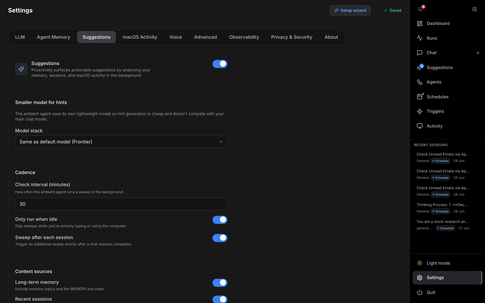

An ambient assistant that proactively surfaces actionable suggestions by analysing your memory, sessions, and macOS activity in the background. Suggestions appear in the **Suggestions** inbox in the left nav.

**Enable Suggestions** — master switch. The rest of the panel appears when on.

**Smaller model for hints** — the ambient agent uses its own lightweight model so hint generation is cheap.

| Option | Description |
|---|---|
| Model stack | `Same as default model`, `Frontier`, `On-Device (MLX)` (recommended), or `Cluster` |
| On-device model | Small cached model (default Qwen3-1.7B-4bit, ~1 GB) when the stack is MLX |

**Cadence**

| Option | Description |
|---|---|
| Check interval (minutes) | How often a background sweep runs (default 30) |
| Only run when idle | Skip sweeps while you're actively using the computer |
| Sweep after each session | Trigger an extra sweep shortly after a chat session completes |

**Context sources** — toggle which signals feed the agent: Long-term memory, Recent sessions, macOS activity, Usage history. **Lookback window (hours)** controls how far back the time-filtered gatherers look (default 24).

**Rate limits & quality**

| Option | Description |
|---|---|
| Max hints per day | Hard cap on new suggestions per 24 h (default 10) |
| Cooldown (hours) | Minimum gap before a similar suggestion resurfaces (default 4) |
| Quiet hours start / end | Hours during which notifications are suppressed (default 22 → 8) |

**Allow one-click approve & run** — adds an "Approve & run" button to each hint that spawns a background session. Risky tool calls still require approval via the normal HITL flow.

---

## macOS Activity

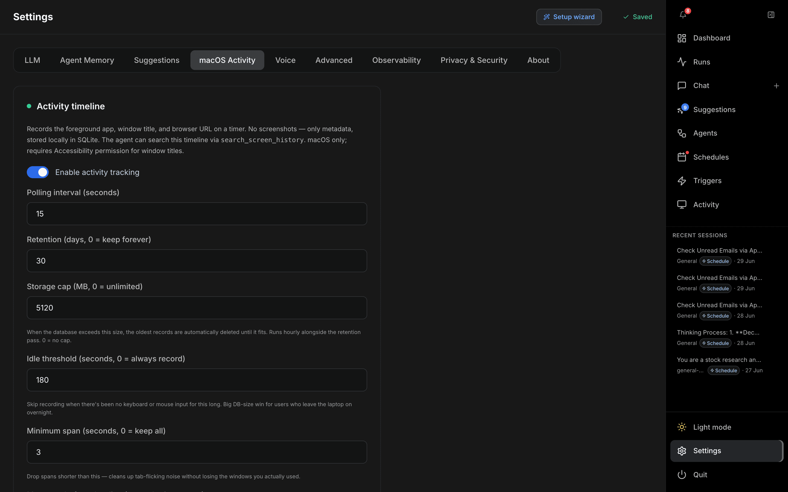

An opt-in, screenshot-free local activity timeline. Records the foreground app, window title, browser URL, and (optionally) visible document/page text into a local SQLite database. Nothing leaves the device. The agent can search it via `search_screen_history`. macOS only; requires **Accessibility permission** for window titles.

| Option | Description |
|---|---|
| Enable activity tracking | Master switch |
| Polling interval | How often to sample the foreground app (seconds, default 15) |
| Retention | Days to keep records (default 30; 0 = keep forever) |
| Storage cap | Max database size in MB (default 5,120; 0 = unlimited). Oldest records pruned hourly when exceeded |
| Idle threshold | Stop recording after N seconds of no keyboard/mouse input (default 180; 0 = always record) |
| Minimum span | Drop spans shorter than N seconds — filters momentary app switches (default 3) |
| Max span before sharding | Split spans longer than N seconds so long focus sessions don't collapse into one row (default 600) |
| Context history size | Rolling log of distinct selections/typed inputs per span in chars (default 4,096; 0 = latest snapshot only) |
| Field value capture limit | Max chars captured from the active text field (Notes, Mail, Pages, Xcode…); default 8,000; 0 = disabled |
| Browser page text capture | Visible page text from Safari/Chrome/Brave/Arc via AppleScript; default 4,000; 0 = disabled |
| UI tree walk capture | Visible text harvested from the Accessibility tree of non-browser apps (Electron/AppKit); default 2,000; 0 = disabled |
| UI tree walk max depth | Recursion depth when descending the AX tree (default 25) |
| Excluded apps | One substring per line — any app whose name matches is never recorded |

**Browser page-text capture requires** enabling JavaScript from Apple Events: Safari → Develop → "Allow JavaScript from Apple Events"; Chrome/Brave → View → Developer → "Allow JavaScript from Apple Events".

**Granting Accessibility permission**

1. Open **System Settings → Privacy & Security → Accessibility**
2. Add OTTO (or your terminal if running from source)
3. The tracker picks up the permission on the next poll cycle — no restart needed

---

## Voice

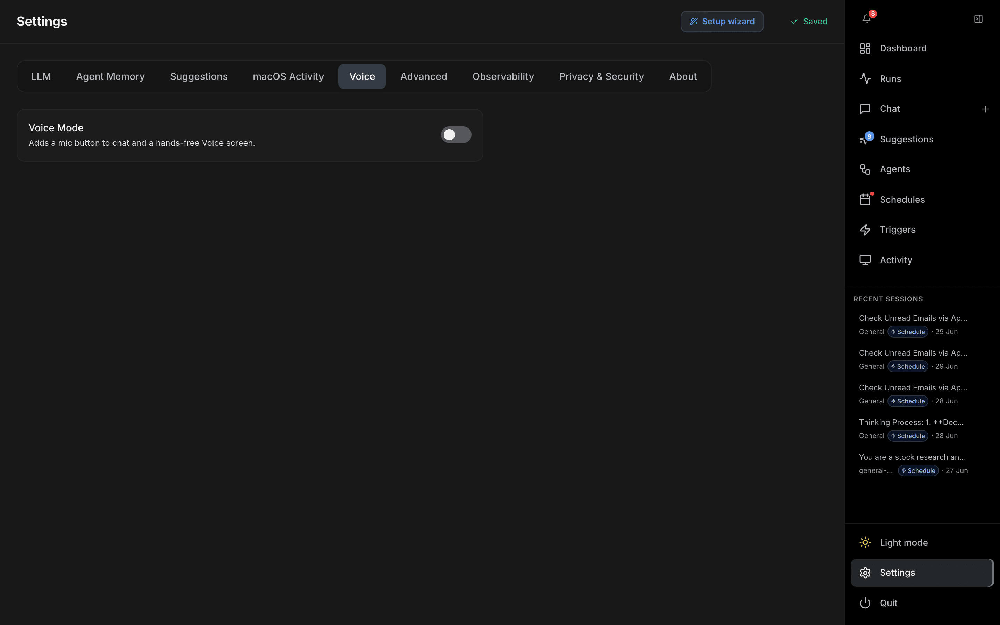

On-device voice input. **Voice Mode** adds a mic button to chat and a hands-free Voice screen. When enabled, two sub-tabs appear: **Speech to Text** and **Wake Word**. All models run locally.

**Speech to Text**

| Option | Description |
|---|---|
| Enable Speech to Text | Transcribe your voice with an on-device Whisper model |
| Input mode | `Hold to speak` (mic button / hotkey) or `Wake word` |
| Global hotkey | Optional push-to-talk hotkey (e.g. `Control+Space`) |
| Language | Transcription language (default `en`; set `fr`, `ja`, `de`, …) |
| Microphone | Input device (defaults to system) |
| Test | Record a sample and verify transcription (downloads Whisper on first use) |
| Model | Whisper model chooser (default `whisper-large-v3-turbo`) |

**Wake Word**

| Option | Description |
|---|---|
| Enable Wake Word | Always-on listening — say "Hey Otto" to activate hands-free |
| Silence threshold | Seconds of silence before recording stops (VAD; default 1.0) |
| Wake phrase | Fixed "Hey Otto" — a built-in on-device model, no download |
| Test wake word | Listen for ~15 seconds and confirm detection |

---

## Advanced

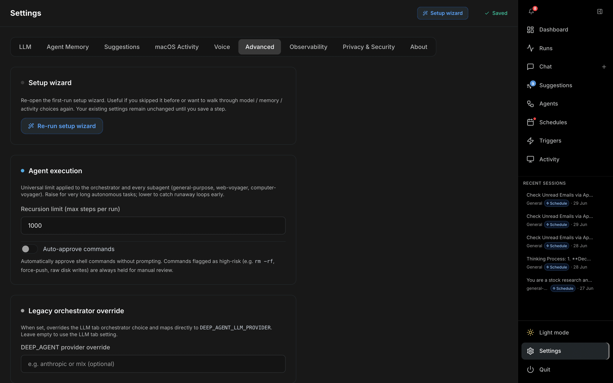

**Setup wizard** — re-run the first-launch wizard to change model, memory, and activity choices. Existing settings are not overwritten until you explicitly save a step.

**Extended Thinking** — available when the default model is Anthropic.

| Option | Description |
|---|---|
| Enable extended thinking | Turns on Claude's extended thinking (chain-of-thought) mode |
| Budget Tokens | Token budget for the thinking block (must be less than Max tokens) |

**Efficiency** — available when the default model is Anthropic.

| Option | Description |
|---|---|
| Efficient tool calls | Reduces token usage via a compact tool-call format. Enabled by default |

**Agent execution**

| Option | Description |
|---|---|
| Recursion limit | Maximum steps the orchestrator and every subagent can take per run (default 1,000; range 1–10,000) |
| Auto-approve commands | Run shell commands without prompting. High-risk commands (e.g. `rm -rf`, force-push, raw disk writes) are always held for manual review |

**Legacy orchestrator override** — when set, overrides the LLM-tab orchestrator choice and maps directly to `DEEP_AGENT_LLM_PROVIDER`. Leave empty to use the LLM-tab setting.

**Ambient scheduling**

| Option | Description |
|---|---|
| Suggest scheduling for repeatable tasks | OTTO offers to automate repeatable tasks (cron, file-event triggers, one-off repeats) at the end of responses |

---

## Observability

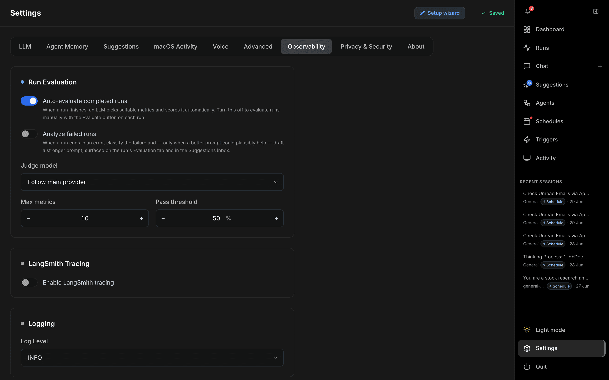

**Run Evaluation** — automatically score and analyse completed runs.

| Option | Description |
|---|---|
| Auto-evaluate completed runs | An LLM picks suitable metrics and scores each run when it finishes |
| Analyze failed runs | Classify failures and, when useful, draft a stronger prompt (shown on the run's Evaluation tab and the Suggestions inbox) |
| Judge model | `Follow main provider`, `Frontier`, or `Local MLX` |
| Max metrics | Number of metrics the judge may pick (1–10, default 4) |
| Pass threshold | Score needed to pass (default 50%) |

**LangSmith Tracing** — stream all LangGraph traces to [LangSmith](https://smith.langchain.com) for debugging and evaluation.

| Option | Description |
|---|---|
| Enable LangSmith tracing | Master switch |
| API key | LangSmith API key |
| Project | Project name (default `Research`) |

**Logging**

| Option | Description |
|---|---|
| Log Level | `DEBUG`, `INFO`, `WARNING`, or `ERROR` — controls backend log verbosity |

---

## Privacy & Security

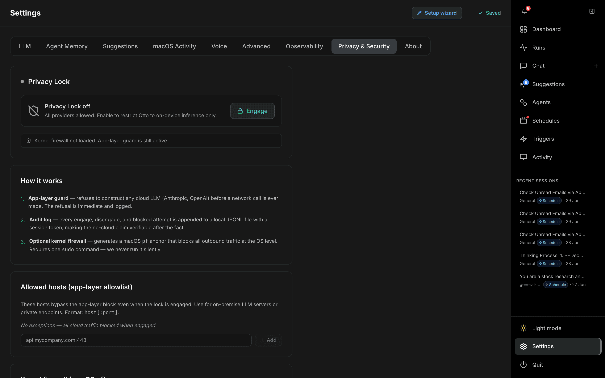

**Privacy Lock** restricts OTTO to on-device inference only — when engaged, cloud LLMs (Anthropic, OpenAI) are blocked before any network call is made, and only local providers are allowed.

| Control | Description |
|---|---|
| Engage / Disengage | Toggle the lock. Engaging stamps a session audit token and records the time |
| Kernel firewall status | Shows whether the optional macOS `pf` anchor is loaded (the app-layer guard is always active) |

**How it works**

1. **App-layer guard** — refuses to construct any cloud LLM before a network call is ever made; the refusal is immediate and logged.
2. **Audit log** — every engage, disengage, and blocked attempt is appended to a local JSONL file with a session token, making the no-cloud claim verifiable.
3. **Optional kernel firewall** — generates a macOS `pf` anchor that blocks all outbound traffic at the OS level. Requires one `sudo` command — never run silently.

| Section | Description |
|---|---|
| Allowed hosts | App-layer allowlist (`host[:port]`) for on-prem LLM servers that bypass the block even when engaged |
| Kernel firewall (macOS pf) | Generates the `pf` rules + install command to copy into Terminal |
| Audit log | Append-only JSONL of every engage / disengage / blocked attempt |

---

## About

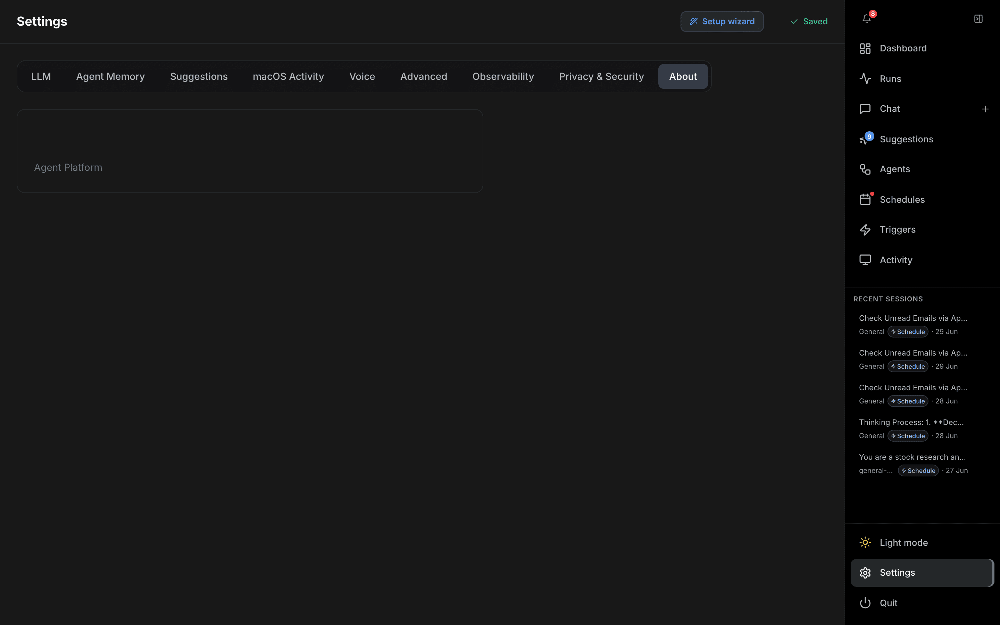

Displays the app version and build info. No configurable options.
