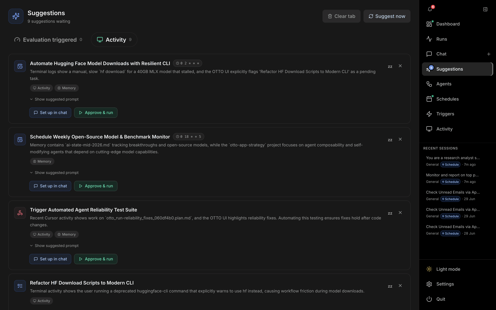

# Suggestions

The **Suggestions** inbox (`/ambient`) is where OTTO's ambient agent surfaces proactive ideas — tasks to run, automations to set up, and improvements to existing schedules and triggers. Open it from **Suggestions** in the right-hand nav; a badge there shows how many suggestions are waiting. The ambient agent is configured under **Settings → Agent Memory → Ambient**.

---

## Header

| Control | Description |
| --- | --- |
| **Suggestions** title | Subtitle shows the pending count, *Running sweep…* while a sweep is active, and a *quiet hours active* note when applicable. |
| **Clear tab / Clear all** | Dismisses every suggestion in the current tab. |
| **Suggest now** | Manually kicks off a sweep. A staged progress banner shows it reading memory, scanning sessions, reviewing macOS activity, checking history and existing automations, then generating suggestions. |

## Tabs

- **Evaluation triggered** — improvements proposed after low-scoring runs (e.g. a better prompt for a schedule or trigger). These offer **Apply to schedule/trigger** to replace the stored prompt with the improved version.
- **Activity** — ideas derived from your memory, sessions, and macOS activity.

Each tab shows its own count, and an empty tab explains how to get suggestions.

## Suggestion cards

Each card shows a kind icon (**Task**, **Automate**, **Schedule**, **Trigger**), a title, rationale, and source chips (Memory, Sessions, Activity, History, Schedules, Triggers, Evaluation). For schedule suggestions a cron chip is shown.

| Action | Description |
| --- | --- |
| **Show suggested prompt** | Expands the full proposed prompt, with a copy button. |
| **Set up in chat / Open in chat** | Opens a new chat pre-filled with the proposed prompt (and suggested agent). |
| **Approve & run** | Runs the suggestion immediately — shown only when auto-run is enabled. |
| **Apply to schedule/trigger** | (Eval suggestions) replaces the stored prompt with the improved one, after confirmation. |
| **zz** | Snoozes the suggestion for 4 hours. |
| **✕** | Dismisses the suggestion. |

A collapsed **Recently actioned** list at the bottom keeps a short trail of accepted/dismissed suggestions.
