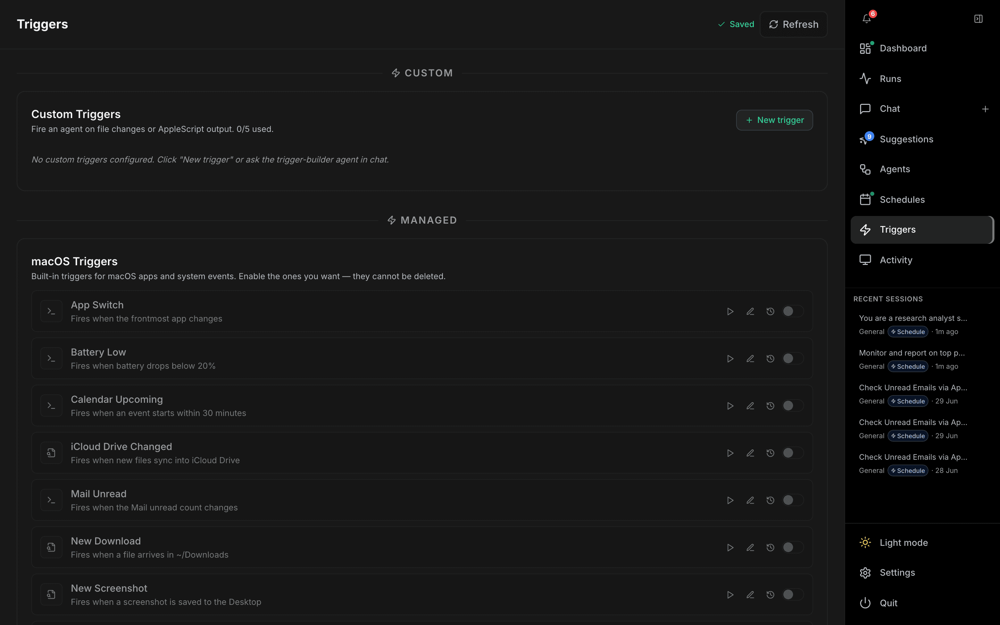

# Triggers

The **Triggers** page (`/triggers`) fires agents in response to events — file changes, AppleScript output, and built-in macOS system events. Open it from **Triggers** in the right-hand nav.

---

## Header

| Control | Description |
| --- | --- |
| **Triggers** title | — |
| **Saved** | A brief indicator confirms changes were persisted. |
| **Refresh** | Reloads trigger state. |

## Custom Triggers

Fire an agent on **file changes** or **AppleScript output**. The section header shows usage against the cap (e.g. `0/5 used`).

- **New trigger** — opens the trigger editor. You can also ask the trigger-builder agent to create one for you in chat.
- The editor supports watching a path for file changes, or running an **AppleScript / JXA** script whose output decides whether the trigger fires.

When none are configured, the section shows a hint to click **New trigger** or use the chat builder.

## Managed (macOS) Triggers

Built-in triggers for common macOS apps and system events. They can be enabled/disabled but **cannot be deleted**. Examples include:

| Trigger | Fires when… |
| --- | --- |
| **App Switch** | the frontmost app changes |
| **Battery Low** | battery drops below 20% |
| **Calendar Upcoming** | an event starts within 30 minutes |
| **iCloud Drive Changed** | new files sync into iCloud Drive |
| **Mail Unread** | the Mail unread count changes |
| **New Download** | a file arrives in ~/Downloads |
| **New Screenshot** | a screenshot is saved to the Desktop |

Each managed trigger row has controls to run it now (play), edit, view history, and an enable toggle.

## Run history

Both custom and managed triggers link to a run-history detail page (`/triggers/:id/runs`) listing every time the trigger fired and what it did.
