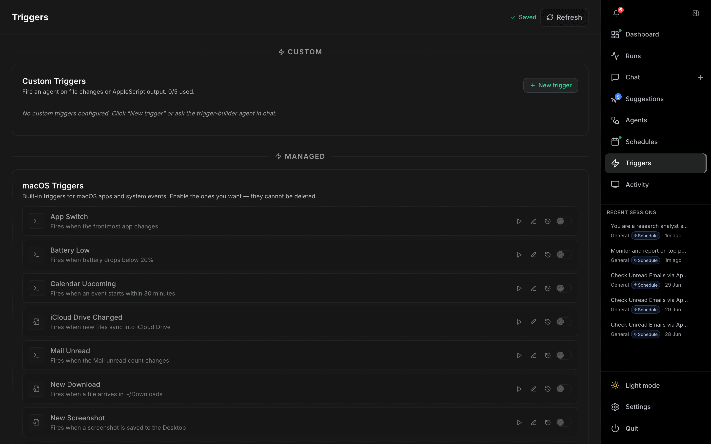
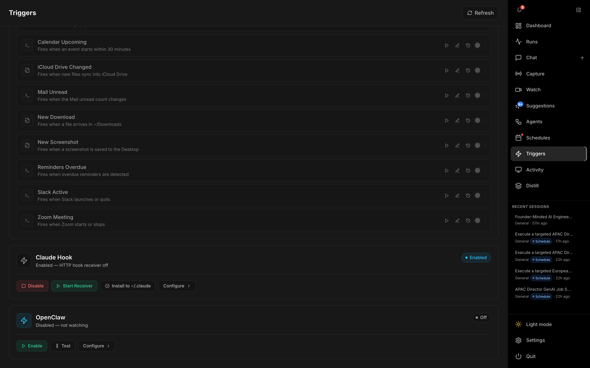

# Triggers

The **Triggers** page (`/triggers`) fires agents in response to events — file changes, AppleScript output, and built-in macOS system events. Open it from **Triggers** in the right-hand nav.

---

## Header

| Control | Description |
| --- | --- |
| **Triggers** title | — |
| **Saved** | A brief indicator confirms changes were persisted. |
| **Refresh** | Reloads trigger state. |

## Custom Triggers

Fire an agent on **file changes** or **AppleScript output**. The section header shows usage against the cap (e.g. `0/5 used`).

- **New trigger** — opens the trigger editor. You can also ask the trigger-builder agent to create one for you in chat.
- The editor supports watching a path for file changes, or running an **AppleScript / JXA** script whose output decides whether the trigger fires.

When none are configured, the section shows a hint to click **New trigger** or use the chat builder.

## Managed (macOS) Triggers

Built-in triggers for common macOS apps and system events. They can be enabled/disabled but **cannot be deleted**. Examples include:

| Trigger | Fires when… |
| --- | --- |
| **App Switch** | the frontmost app changes |
| **Battery Low** | battery drops below 20% |
| **Calendar Upcoming** | an event starts within 30 minutes |
| **iCloud Drive Changed** | new files sync into iCloud Drive |
| **Mail Unread** | the Mail unread count changes |
| **New Download** | a file arrives in ~/Downloads |
| **New Screenshot** | a screenshot is saved to the Desktop |

Each managed trigger row has controls to run it now (play), edit, view history, and an enable toggle.

## Run history

Both custom and managed triggers link to a run-history detail page (`/triggers/:id/runs`) listing every time the trigger fired and what it did.

## Claude Hook

**Claude Hook** receives events from Claude Code so Otto can watch those sessions, gate quality, and optionally start an eval agent.

| Control | Description |
|---|---|
| **Enable / Disable** | Master switch. Off means Otto is not receiving events. |
| **Start Receiver / Stop Receiver** | HTTP hook receiver. While it is running the card shows **Receiving** plus the active-session count. |
| **Install to ~/.claude** | Writes the hook snippet into Claude Code's config so events post back to Otto. |
| **Configure** | HTTP receiver, quality gate, auto-monitor, and custom hooks. |

**Configure** options:

- **HTTP hooks** — Claude Code posts events directly, so live monitoring does not wait on a poll.
- **Quality gate** — when Claude finishes, Otto checks the tool-error rate. Above the threshold, Claude is told to keep working. Adds about 1–3 seconds to each stop event.
- **Auto-monitor** — starts an eval agent when Claude Code opens a new session, with a cap on concurrent auto-sessions and a choice of which agent to use.
- **Custom hooks** — extra prompts, tool gates, or context, merged into the installed snippet. Events include `PreToolUse`, `PostToolUse`, `Stop`, `SubagentStart` / `SubagentStop`, `SessionStart` / `SessionEnd`, and the shell, file, and MCP events Claude Code emits.

## OpenClaw

**OpenClaw** watches an OpenClaw state directory (local files under `~/.openclaw`, or the same tree on a remote host over SSH) and can start an eval session when a new OpenClaw session appears.

| Control | Description |
|---|---|
| **Enable / Disable** | Master switch. |
| **Start Watcher / Stop Watcher** | Scans the sessions directory on an interval and pushes events into the eval pipeline. SSH mode requires a host before the watcher can start. |
| **Test** | Checks that the state directory (or SSH connection) is reachable. |
| **Configure** | Connection, watcher interval, and auto-monitor. |

**Configure** options:

| Option | Description |
|---|---|
| Access mode | `Local` reads files on this machine. `SSH` reads them from a remote host (host, user, key path, port). |
| State directory | OpenClaw state path (default `~/.openclaw`). |
| Session watcher | Poll interval from 5 to 60 seconds (default 10). |
| Auto-monitor | Starts an eval agent when a new OpenClaw session is detected, with a max concurrent auto-session count and an agent picker. |
