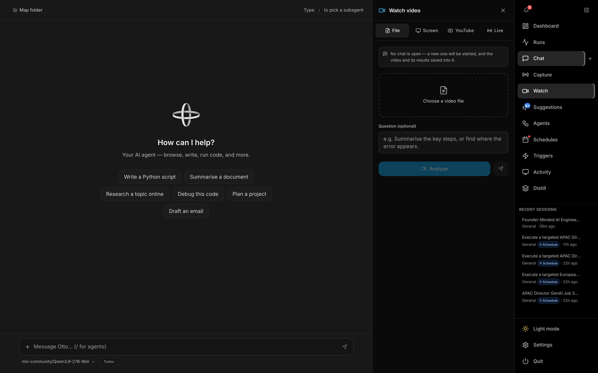
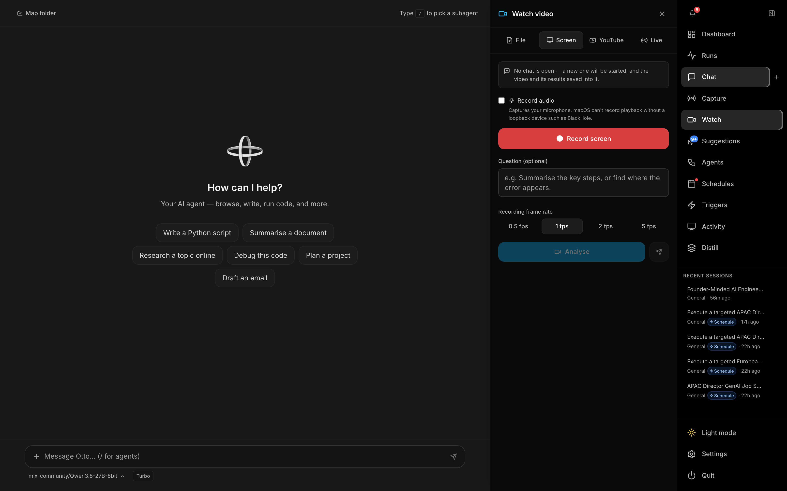
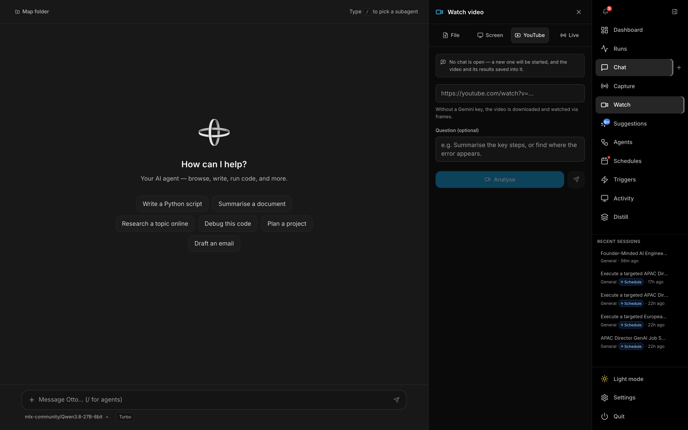
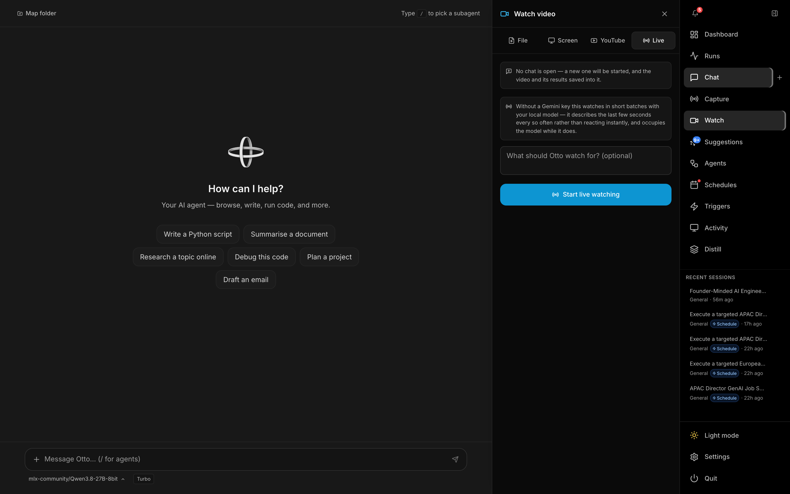

# Watch

**Watch** opens **Watch video** — a panel that sits beside [Chat](chat.md) and lets Otto watch a video file, a screen recording, a YouTube URL, or your screen live. Open it from **Watch** in the right-hand nav. Like [Capture](capture.md), it is a toggleable panel, not its own route, so a recording or live watch keeps running while you move around the rest of the app.

With a Gemini API key (Settings → LLM → Frontier → Google Gemini), Gemini watches the clip natively — frames, audio, and timestamps. Without one, Otto samples frames with ffmpeg, attaches an on-device transcript, and sends those to whatever model is selected. Live watching without Gemini uses the local vision model in short batches instead of a realtime stream.

If no chat is open, Watch starts a new one and saves the video and its results there.

---

## Sources

Four tabs across the top of the panel.

| Tab | What Otto watches |
|---|---|
| **File** | A video you choose from disk. The file is uploaded into the session, then **Analyse** runs. |
| **Screen** | A recording of your screen, started and stopped from the panel. Optional **Record audio**. |
| **YouTube** | A public YouTube URL. With Gemini the URL is watched directly; otherwise the video is downloaded and watched as frames. |
| **Live** | The screen, described as it happens. Optional prompt: *What should Otto watch for?* |

**Screen** needs Screen Recording permission. If it is missing, the panel links straight to System Settings. **Record audio** uses a loopback device (such as BlackHole) when one is present; otherwise it records the microphone — macOS cannot capture speaker playback without a loopback device.

Recording frame rate for a screen capture is **0.5 / 1 / 2 / 5 fps**. A live preview of the recording appears when **Show a preview** is on in [Settings → Video](settings.md#video).

---

## Analyse and send to chat

On **File**, **Screen**, and **YouTube**, an optional **Question** tells Otto what to look for (for example, *Summarise the key steps*, or *find where the error appears*).

| Control | Behaviour |
|---|---|
| **Analyse** | Watches the current source and writes the result in the panel |
| **Send** (paper-plane) | Hands the video to the open chat so the agent watches it as part of the conversation |

The result stays in the panel. The video file and any saved transcript land in the session.

---

## Live watching

**Start live watching** streams the screen. A preview (when enabled) shows the exact frames the model is seeing, badged **Gemini** or **Local**. Commentary accumulates in the panel; the trash icon clears it.

Commentary is context, not a new user message — it does not start an agent turn by itself. How it reaches the agent is set under [Settings → Video → Live watching](settings.md#video):

| Setting | Behaviour |
|---|---|
| **Off** | Commentary stays in the Watch panel |
| **When I stop** | The whole session is handed over when you stop watching |
| **Live** | Chunks are handed over on a timer while watching (default 20 seconds) |

Without a Gemini key, live watching describes the last few seconds in batches on your local model and occupies that model while it does. Gemini Live is capped at 1 frame per second.

---

## Permissions

| Permission | Needed for |
|---|---|
| Screen Recording | Screen recordings, live watching, and the recording preview |

Declared in the app's usage-description strings, so macOS shows a reason in the permission dialog.

---

## Related

- **[Settings → Video](settings.md#video)** — model preference, frame rate, clip limits, YouTube, transcripts, live hand-off, and debug frame saving.
- **[Chat](chat.md)** — where an analysed video and its result are stored.
- **[Capture](capture.md)** — on-device audio transcription and still screenshots. Watch is for video; Capture is for speech and stills.
